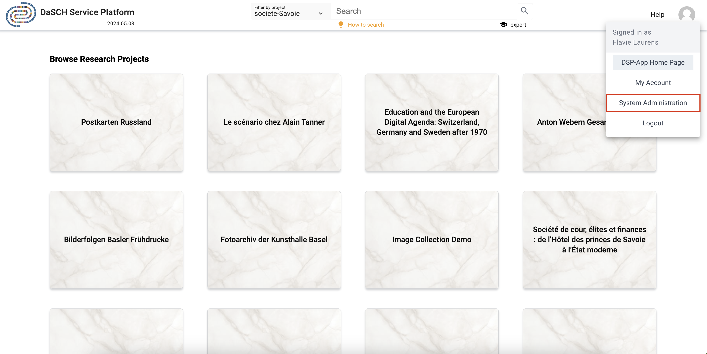

# System Administration

&#9888; Only for System administrator

System administrators can get an overview of all projects and all users stored in DSP.

*System administration part is accessible from the user menu in the header.*

---

## All projects

System admin gets the list of all activated projects as well as archived projects. It is possible to create a new research project, the required information must be filled in.
For each project, the system admin has the possibility to edit the project information and archive the project.

*Overview of all activated projects, the list of archived projects is displayed below.*

---

## All users

System admin gets the list of all activated and suspended users registered in DSP.
New users can be created from this page only (button "Create new").

*Overview of all users where the system admin has access to several actions.*

For each user, the system admin has access to several actions:

- *Add as system admin* or *Remove as system admin*: add or remove the user role of *system admin*

- *Edit user*: edit the user information (e.g. first name, last name, default language)

- *Change user's password*: the system admin can update the user's password if the user has forgotten it, the system admin must enter his password first (&#9888; a reset password functionality will be implemented in a later version on the login page)

- *Manage project membership*: the system admin can assign the selected user to one or several project, or remove the user from a specific project

- *Suspend user*: the user is deactivated and has no more access to DSP-APP. The system admin can reactivate it at any time.
