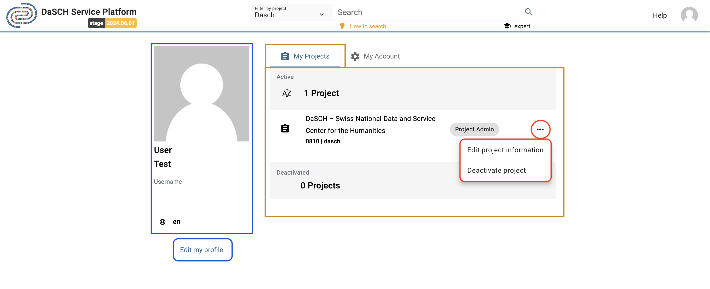
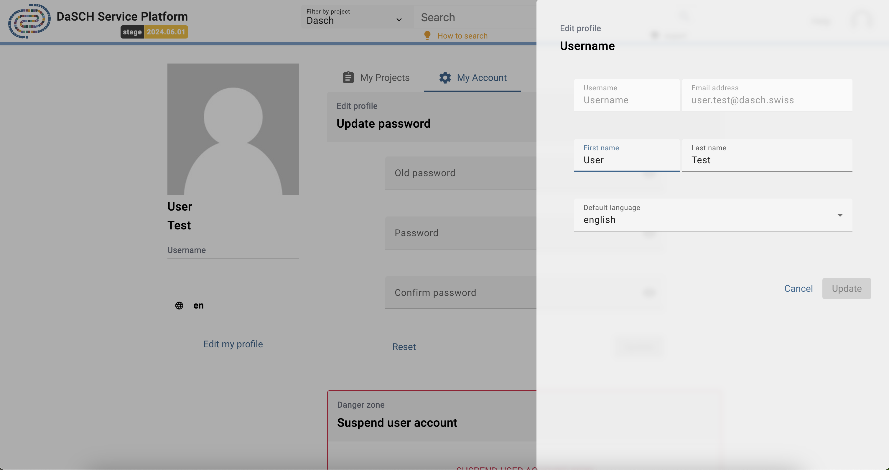
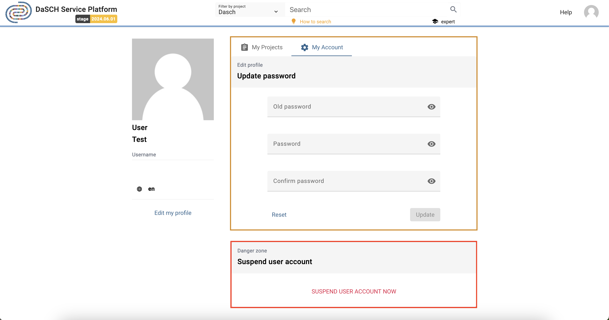

# User Management

*https://app2.dasch.swiss/dashboard - Get access to your user profile, collections and  account from the main user menu.*

---

## Your user profile and projects

To change your personal information as well as your default language used by the interface, you can edit your profile clicking *Edit*. Currently, the avatar image comes from gravatar.com (go on their [website](http://en.gravatar.com/) to register if you want your customized user photo).

*https://app2.dasch.swiss/projects - Overview of your user profile and your projects.*

The list of your projects is accessible, click on one project to get more information about it. As project admin, you can also edit or archive your projects, and as system admin, you can additionally create new project on this page.

*Edit your user profile. The username, the email address and the admin rules are not editable.*

---

## Your collections

&#9888; *NOT YET IMPLEMENTED*

You will be able to store collections of sources or specific searches to work with them later or share them with collaborators.

---

## Your account

As a matter of security, it is strongly recommended to update your password at least once a year. In your account page, you can update your password.

*https://app2.test.dasch.swiss/account - Update your password and deactivate your user account.*

&#9888;
You can delete (deactivate) your own user account. Only a system administrator will be able to reactivate it.
