# Data management

Once your [data model](https://docs.dasch.swiss/latest/DSP-APP/user-guide/project/#data-model) is ready, you're able to add data. The DSP-APP offers several possibilities to add data, whether you are starting from scratch or importing data from another program.

## Start from scratch

When a project starts from scratch, you will enter and generate new data directly in the DSP-APP itself. Generating new data can be done one by one with a form at the moment:

- Upload files, e.g., an audio file, photography, a video, or a document
- Augment the metadata

### Create new resource instances

You can create a new resource instance using the "create new resource" form:

*There is a button to open the create new resource form in the main header.*

**Step1:** Select the project you want to work with (if you are part of several ones), select the ontology (if the project has several ones), and then select the resource class you want to create a new instance. Click on Next.

*Step 1: Create a new resource instance e.g. a new audio file.*

**Step2:** Fill in the form and upload the file if requested (depending on the type of resource). Please, note that the required fields are marked with an asterisk `*` after the property label. Click on `Save` to create the new resource instance. To go back to Step 1, click on `Back`. If you cannot click on `Save`, it means that a required field has not been filled in.

*Step2: Create a new resource instance e.g. a new audio file in MP3 format.*

N.B.: Please, note that the image, video, and audio files must be in one of the required file types supported by the database. The supported types are listed in the upload section of the form.

---

## Search and browse

DSP-APP offers the possibility for the user to search in 3 different ways: **full-text** search, **advanced** search, and **expert** search (Gravsearch query). The search bar is always available in the header of each page, whether logged in or out.

### Full-text search

The full-text search performs queries including one or more terms or phrases and returns data that matches search conditions. By default, the search is performed in all projects stored in DSP. However, it is possible to filter by the project using the menu "Filter by project" on the left side of the search bar.

*<https://admin.dasch.swiss> - Search 1: Full-text search*

When clicking on the search bar, the search history panel is displayed. The **10** last searches are registered. It is also possible to clear the search history list (*Clear list* button at the bottom of the panel or the *x* at the end of each line).

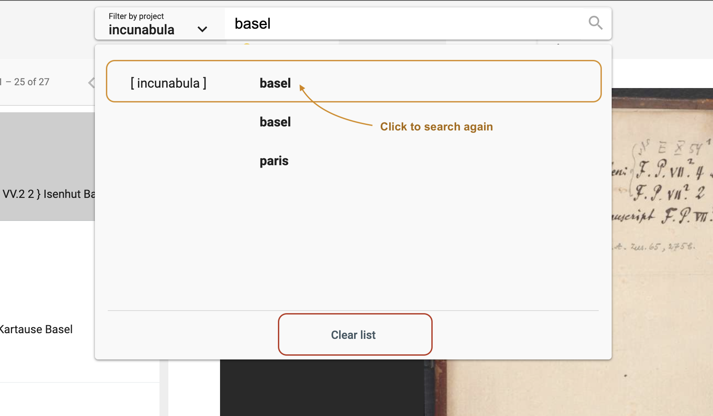*Search history list is accessible for the full-text search from any webpage.*

Special syntax:

- question mark? can be used as a wildcard symbol for a single character.
- asterisk* can be used as a wildcard symbol for zero, one, or multiple characters.
- "quotation marks" searches for the whole pattern.

---

### Advanced search

The advanced search allows the creation of complex queries using a form.
The form creates a string representing a Gravsearch (SPARQL) query to be sent to DSP-API.

A query consists of the following elements:

- selection of the data model
- selection of a resource class belonging to the selected data model (optional)
- specification of properties, comparison operators, and values (optional).

Although the selection of a resource or a property or both are optional, either a resource class has to be selected or at least one property has to be specified, otherwise, the query is not considered valid and cannot be submitted.

*<https://admin.dasch.swiss> - Search 2: Advanced search offers many filter combinations and is a powerful search tool.*

#### Comparison Operators

Depending on the value type of the chosen property,
one or more of the following comparison operators can be selected:

- `is equal to`: value equality: same number, exact same string, an overlap of date periods, same target resource.
- `is not equal to`: value inequality: not same number, not exact same string, no overlap of date periods, not same target resource.
- `is greater than`: value comparison: number is greater than search value, date period begins after search value.
- `is greater than or equal to` value equality/value comparison: number is equal to or greater than search value, an overlap of date periods or date period begins after search value.
- `is less than`: value comparison: number is less than search value, date period ends before search value.
- `is less than or equal to`: value equality/value comparison: number is equal to or less than search value, an overlap of date periods or date period ends before search value.
- `exists`: value for the given property exists.
- `is like`: search value is contained in a text using the SPARQL [REGEX](https://www.w3.org/TR/sparql11-query/#func-regex) function (supports regular expressions).
- `matches`:
  - text property: search value matches the text ([Lucene Query Parser Syntax](https://docs-api.dasch.swiss/08-lucene/lucene-query-parser-syntax/)).
  - linking property: matches the specified linked resource.

#### Search Examples

##### is like (regular Expressions)

The `is like` operator lets the user search for texts that are *like* the search value via the support of regular expressions
In this example, all books are found whose title contains "Narrenschiff" followed by a space and some other characters like "(lat.)" or "(dt.)".

For general information about regular expressions, see this [interactive tutorial](https://regexone.com).

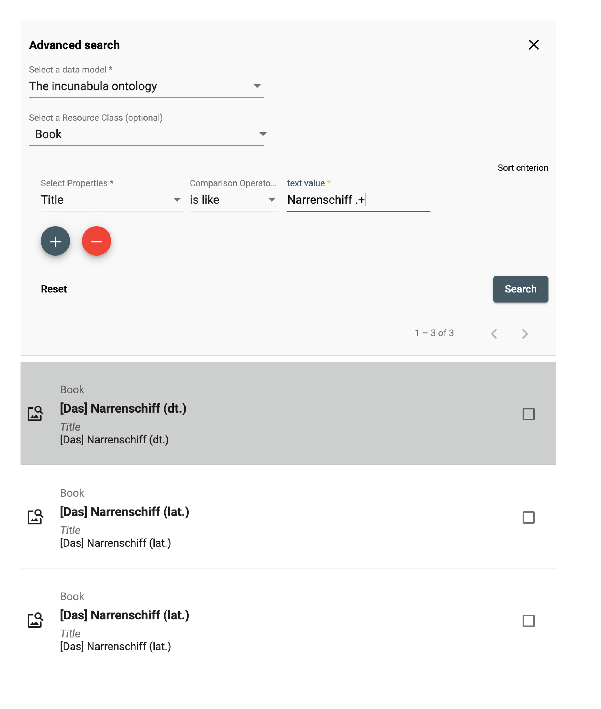

##### matches (Lucene Parser Syntax)

Used with a text property, the `matches` operator lets the user search for texts that *match* the search value,
supporting [Lucene Query Parser Syntax](https://docs-api.dasch.swiss/08-lucene/lucene-query-parser-syntax/).
In this example, all persons are found whose names contain "Ja" and "ob" with a character in between (represented by the wildcard "?").
This search finds "Jacob" as well as "Jakob".

**Note the difference between regular expressions and Lucene parser syntax!**

##### matches (specifying a Linked Resource)

Used with a linking property, the `matches` operator lets the user search for a linked resource that matches the specified properties.
In this example, the user writes a query looking for all letters that have an author that:

1. was born after January 1st, 1650
1. whose family name is "Bernoulli"

This is different from the "is equal to" operator that lets the user specify a certain person (selected from a list).

---

### Expert search

The expert search can be more powerful than the advanced search, but requires knowing how to use the query language Gravsearch (based on SparQL and developed by the DaSCH team). With Gravsearch, expert users can build searches by combining text-related criteria with any other criteria.

**For example**: you could search for a page in a manuscript that contains a certain element and also mentions a person, who lived in the same country as another person, who is the author of another author.

*<https://admin.dasch.swiss> - Search 3: Expert search is a text area in which you can create Gravsearch queries. Here is the default example you can find in the app.*

To learn Gravsearch, go to the DSP-API documentation [&rarr; Gravsearch](https://docs-api.dasch.swiss/03-apis/api-v2/query-language/)

---

## Search results

<!-- ### Simple list -->
The results of the search are displayed in an organized list<!--with a small preview-->. You can select one result at a time to get more information.

*Search result 1: Simple list of results, similar to Google's list of results.*

&#9888;
It is not possible to sort or order by criteria when searching with the full-text search, use the advanced search or the expert search instead to get back sorted results.
<!--
---

### Grid list: Lighttable
&#9888; *NOT YET IMPLEMENTED*

The results of the search are displayed in a grid list with a big preview. You can select one result at a time to get more information.

*Search result 2: A preview list where the results are presented in tiles.*

---

### Table: Excel-like view
&#9888; *NOT YET IMPLEMENTED*

The search results are displayed in a table with the option to sort them. This layout is enabled when the search has been performed with **only one resource type**.
Each column of the table corresponds to one metadata.

*Search result 3: An Excel-like table view to edit multiple resources at once.*

-->
---

## Do research and work on your data

Once you have found the desired resources, you can (re)view them and annotate the resource itself, the media file, or single metadata values. If you select more than one resource, you can compare them in a side-by-side view or link them.<!--edit them all at once, or save them in a collection. A collection is similar to a playlist in a music app or shopping basket in an online store-->

### Data permissions

In order to know what you are allowed to see or do with the selected resource, please check the permissions that are granted for your user role. You can find more details about the [permissions in the documentation of DSP-API](https://docs.dasch.swiss/latest/DSP-API/02-knora-ontologies/knora-base/?h=permission#permissions).

If you don't have the permissions you were supposed to get, please contact the [DaSCH team](mailto:support@dasch.swiss).

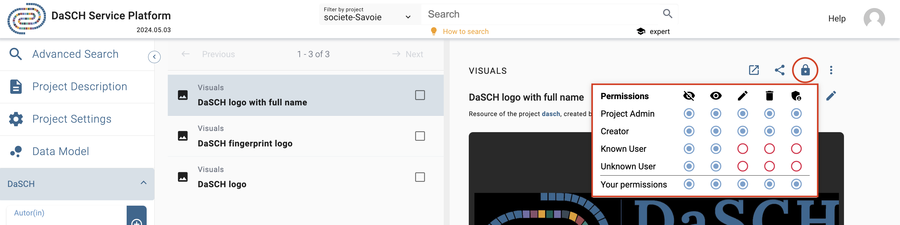*Check the resource permissions you are granted.*

### Display data

#### Display a resource

DSP-APP offers different resource views for different media types. There's a viewer for still images, moving images, audio, and document files. You open them from the list of search results. Depending on the media type, DSP-APP offers different tools to work on the resource.

In a still image resource, you're able to draw regions on the image and annotate this region. Usually, a still image resource is used for book pages, photographs, postcards, letters, etc.

<!--In time-based resources like moving images or audio documents, you can mark sequences on the timeline. A transcription tool helps to annotate and to transcribe the sequence.-->

*Single resource view. The resource type in this example is "Page".*

Additionally, you can work on the resource directly, e.g, mark regions of interest on still images and on documents.

##### Audio file

##### Image file

When you open a resource that contains an image, this one is displayed in a viewer. Several functionalities are accessible from the image viewer, e.g. zoom in/out, copy the IIIF link, replace the image or draw a region on the image.

*Image viewer toolbar.*

To access the regions, go to the annotation panel. You can **click on a region** in the image viewer, the focus of the page will be redirected to the annotation information.

*Access the annotation panel from the resource toolbar.*

##### PDF file

##### Text file

##### Video file

##### ZIP file

#### Display resource properties

By default, only important properties are shown in the resource viewer. To display them all, click on the "unfold" button in the resource toolbar.

*Show or hide properties from the toolbar.*

To get more information about the property value, i.e. date of creation and author name, you mouse over the value and then on the info button.

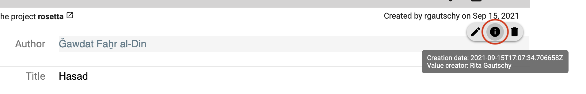*Get the creation date and the author name of the value.*

#### Display a value comment

To display the existing value comment, you mouse over the property value and click on the comment button (3rd icon from the left).

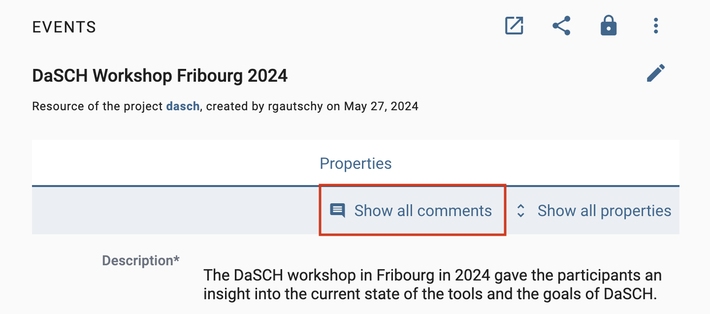*Mouse over the property value to see if there is a comment and display it.*

---

### Display and compare several resources

You can compare 2 or more resources of any type at the same time side by side. From the search result list, select your resources of interest by checking the checkbox (right side of each result) and clicking on the compare button on the right-side tile.

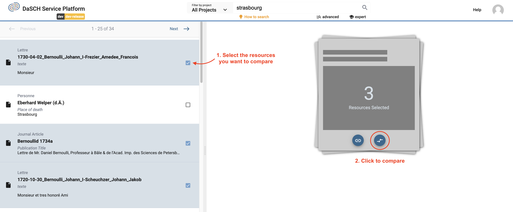*Example: Select 3 resources and compare them.*

To keep in mind: The more you compare, the smaller the resource viewer for each will be. You can deselect one or more resources to remove them from the compare viewer.

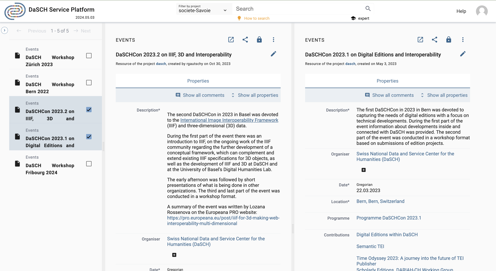*Visualise your selected resources side-by-side. You can compare 2 images with an object without representation for instance.*

---

### Add new data

&#9888; You must have the granted permission to proceed.

#### Add a resource

See section [Create new resource instances](https://docs.dasch.swiss/latest/DSP-APP/user-guide/data/#create-new-resource-instances).

#### Add a property value

You can create a new property value **if your data model allows it**. The value should have a cardinality of 0-1, 0-N or, 1-N.
A "plus" button is displayed to the right of the label or after the first value field. You fill in the form field and save the changes by clicking on the floppy disk button. You can undo (back arrow button) or cancel the changes (x button).

*Add a new property value.*

*Save or undo the changes you made.*

If your property is linked to another resource, you can search for an existing value by typing the first letter of the resource label you are looking for. You can also create a new resource instance by clicking on the first option in the drop-down menu, `Create new: xxx`.

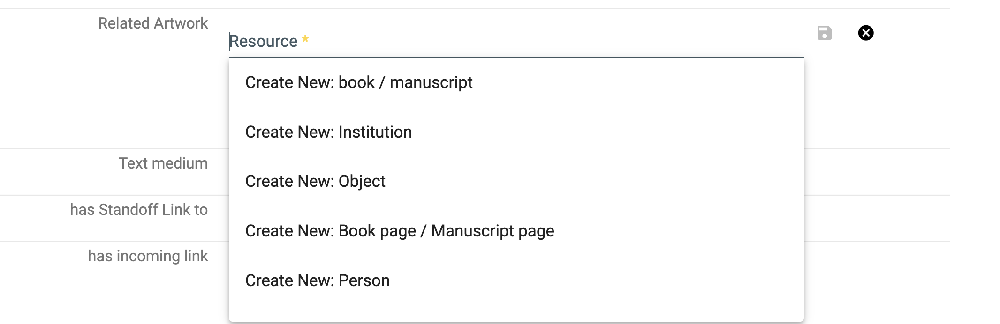

#### Add an image region

To create a new region on an image, you click on the button Draw a region in the toolbar, then select the region you want on the image.

*Select a region on the image with the drawing tool.*

Enter the information about the region, an informative label and a description as a comment. You can change the color.

*Fill in the form about the selected region.*

The new region information is displayed after the image viewer. You can edit or delete if you have the granted permissions. A region has also an AKR URL you can copy and share.

*A new region has been created.*

---

### Edit your data

&#9888; You must have the granted permission to proceed.

#### Edit a resource

To edit the resource label, you reach the edit form by opening the resource menu on the right-side of the toolbar and clicking on `Edit label`.

#### Edit a property value

You can edit a property value from the resource viewer. You mouse over the value and click on the edit button.

*Edit button when mousing over the value.*

You edit your value by changing the text content, searching for another resource label, or creating a new resource instance. Don't forget to save your changes (floppy disk button) or undo them (back arrow button) to leave the edit mode.

It is the same process to add, edit or delete a comment to the value.

---

### Delete your data

&#9888; You must have the granted permission to proceed.

#### Delete or erase a resource

To delete a resource, there are 2 possibilities:

1. **Delete** resource: the resource is not searchable or findable in DSP-APP anymore but the data still exists in the database.

2. **Erase** resource: the resource is **definitely** deleted from the database, it will be impossible to get it back.

*Delete or erase a resource.*

#### Delete a property value

You can delete a property value. You mouse over the value and click on the delete button. You have to confirm your choice. It is possible to comment on the deletion of the value in the confirmation pop-up window to explain why it is being deleted.

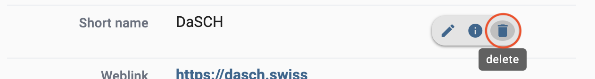*Delete a property value.*

---

### Annotate and link data

The main feature of the flexible data storage that DSP-APP uses is the possibility to annotate and link resources and their metadata. An annotation can be a small note about a date like "Not sure about the birthdate of this person. There's another date mentioned in the resource XYZ". Inside the note, it will be possible to link to another resource.

Links in DSP-APP are always bi-directional. If you link resource A with resource B, then resource B knows about this connection. If you find resource B, you have the connection to resource A as well.

It is possible to link resources of the same project or from 2 different projects.

DSP-APP offers two ways to link data:

1. Internal linkage: it allows you to create a direct link between 2 resources. The label of the linking resource (source) will appear in the „incoming links“ section of the targeted resource. You will choose this option when you want to embed the link in a text.

2. Link object:  it allows you to create an annotation (the description of the link object) that can point to one or more resources. You will prefer this option if you want the link to exist and describe it.

#### Internal linkage

To link 2 resources (A is an image and B is a document in the example), you go to your resource A that will be linked, open the **Share** menu and click on the button `Copy internal link on clipboard`. You have copied the internal link of your resource A that will be used to make the link with your resource B.

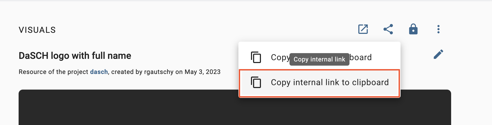*Copy the internal link of the resource A.*

Go to your resource B. You click on the **edit** button of the property value where you want to add the link (by mousing over the value content). This value must be of type **rich text**.

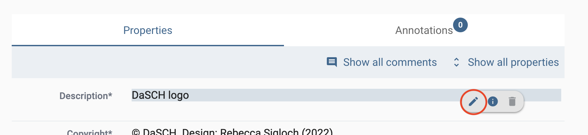*Edit the property value of type rich text to add the link.*

You write and select a word or a group of words you want to attach the link to, then click on the **Link** button in the toolbar of the text editor, paste the internal link of resource A here, and click on **Save**.

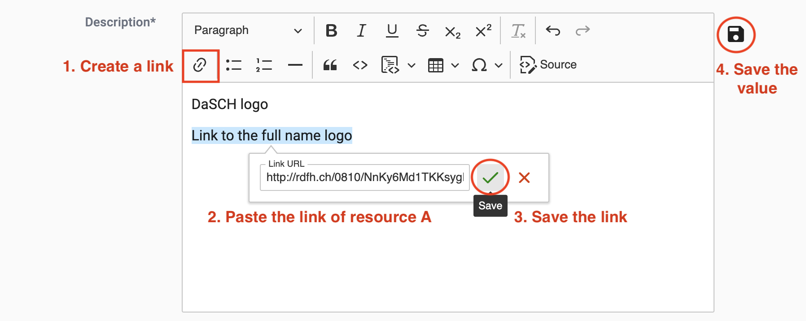*Add the link in your text and save.*

The word (or the group of words) is now highlighted in blue-grey and is clickable.

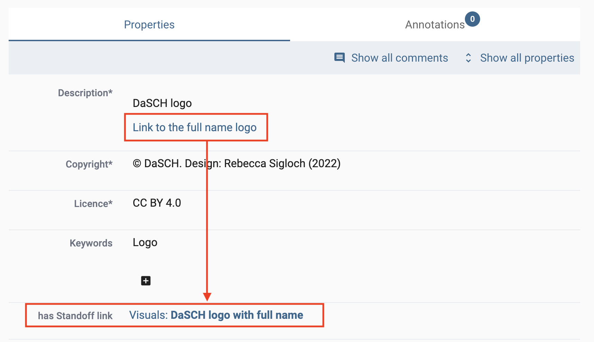*The link has been added to your text.*

#### Link Object

To create a link object, the process starts from the search result list. You select 2 or more resources from the list and click on the button Create a link object from this selection.

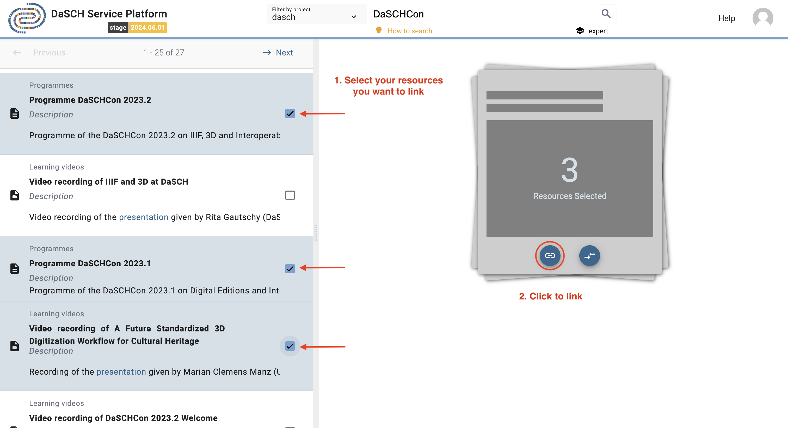*Select the resources to link.*

You fill out the form indicating the project in which you want to register the link object, as well as a label to identify it. Optionally, you can add a comment (annotation) to describe this collection of resources. Then, click on Create.

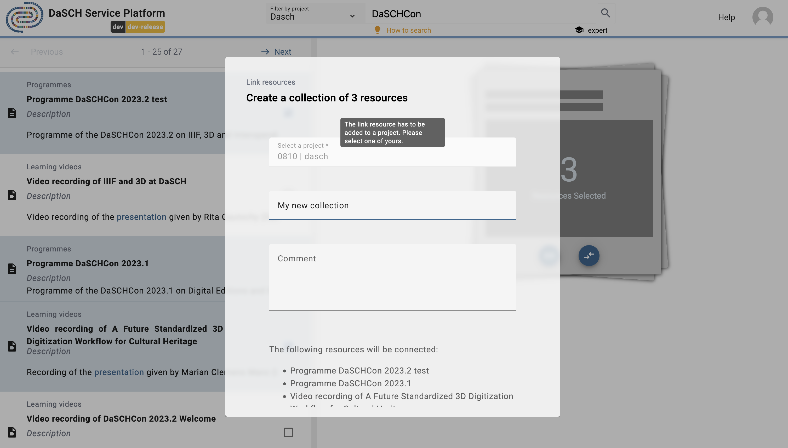*Fill in the form about the new link object.*

The linked resources are listed in the `has Link to` property of the link object resource viewer. The label of your link object is searchable through a [full-text search](https://docs.dasch.swiss/latest/DSP-APP/user-guide/data/#full-text-search).

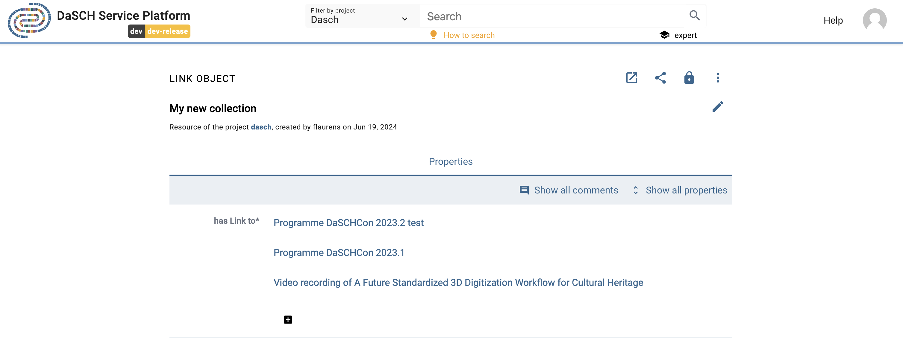

It is possible to add other resources later on by clicking on the `+` button in the `has Link to` property section.

---

### Share your data

Each resource of your dataset gets an ARK URL (Archival Resource Key), a persistent identifier that will allow citing permanently your resource in papers, conference presentations, books, etc.

You will find it in the **Share** menu of the resource toolbar, click on `Copy ARK to clipboard` to copy and paste it wherever you want.

*Copy ARK URL.*
