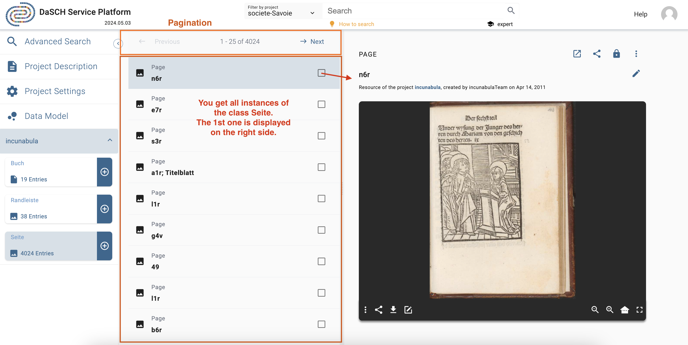

# Data management

Once your [data model](https://docs.dasch.swiss/latest/DSP-APP/user-guide/project/#data-model) is ready, you're able to add data. The DSP-APP offers several possibilities to add data, whether you are starting from scratch or importing data from another program.

## Start from scratch

When a project starts from scratch, you will enter and generate new data directly in the DSP-APP itself. Generating new data can be done one by one with a form at the moment:

- Upload files, e.g., an audio file, a photography, a video or a document
- Augment the metadata

### Create new resource instances

You can create a new resource instance using the "create new resource" form:

*There is a button to open the create new resource form in the main header.*

**Step1:** Select the project you want to work with (if you are part of several ones), select the ontology (if the project has several ones), and then select the resource class you want to create a new instance. Click on Next.

*Step 1: Create a new resource instance e.g. a new audio file.*

**Step2:** Fill in the form and upload the file if requested (depending on the type of resource). Please, note that the required fields are marked with an asterisk `*` after the property label. Click on `Save` to create the new resource instance. To go back to Step 1, click on `Back`.

*Step2: Create a new resource instance e.g. a new audio file in MP3 format.*

N.B.: Please, note that the image, video and audio files must be in one of the required file types supported by the database. The supported types are listed in the upload section of the form.

---

### Link resources

The workspace of the DSP-APP allows you to connect different resources, even if they're not in the same project (linkage), to comment on a resource and on their metadata fields (annotate). These actions will generate more data and will help to find specific resources and their relations easily.

---

## Search and browse

DSP-APP offers the possibility to the user to search in 3 different ways: **full text** search, **advanced** search and **expert** search (Gravsearch query). The search bar is always available in the header of each page, whether logged in or out.

### Full text search

Full text search performs queries including one or more terms or phrases, and returns data that matches search conditions. By default, the search is performed in all projects stored in DSP. However, it is possible to filter by project using the menu "Filter by project" on the left side of the search bar.

*<https://admin.dasch.swiss> - Search 1: Full text search*

When clicking on the search bar, the search history panel is displayed. The **10** last searches are registered. It is also possible to clear the search history list (*Clear list* button at the bottom of the panel or the *x* at the end of each line).

*Search history list is accessible for the full text search from any webpage.*

Special syntax:

- question mark? can be used as wildcard symbol for a single character.
- asterisk* can be used as a wildcard symbol for zero, one or multiple characters.
- "quotation marks" searches for the whole pattern.

---

### Advanced search

The advanced search allows for the creation of complex queries using a graphical widget.
The widget's contents are then turned into a string representing a Gravsearch (SPARQL) query to be sent to DSP-API.

A query consists of the following elements:

- data model selection
- selection of a resource class belonging to the selected data model (optional)
- specification of properties, comparison operators, and values (optional).

Although selection of a resource or a property or both are optional, either a resource class has to be selected or at least one property has to be specified,
otherwise the query is not considered valid and cannot be submitted.

*<https://admin.dasch.swiss/search/advanced> - Search 2: Advanced search offers many filter combinations and is a powerful search tool.*

#### Comparison Operators

Depending on the value type of the chosen property,
one or more of the following comparison operators can be selected:

- `is equal to`: value equality: same number, exact same string, overlap of date periods, same target resource.
- `is not equal to`: value inequality: not same number, not exact same string, no overlap of date periods, not same target resource.
- `is greater than`: value comparison: number is greater than search value, date period begins after search value.
- `is greater than or equal to` value equality / value comparison: number is equal to or greater than search value, overlap of date periods or date period begins after search value.
- `is less than`: value comparison: number is less than search value, date period ends before search value.
- `is less than or equal to`: value equality / value comparison: number is equal to or less than search value, overlap of date periods or date period ends before search value.
- `exists`: value for the given property exists.
- `is like`: search value is contained in a text using the SPARQL [REGEX](https://www.w3.org/TR/sparql11-query/#func-regex) function (supports regular expressions).
- `matches`:
  - text property: search value matches the text ([Lucene Query Parser Syntax](https://docs-api.dasch.swiss/08-lucene/lucene-query-parser-syntax/)).
  - linking property: matches the specified linked resource.

#### Search Examples

##### Regular Expressions (is like)

The `is like` operator lets the user search for texts that are *like* the search value via the support of regular expressions
In this example, all books are found whose title contains "Narrenschiff" followed by a space and some other characters like "(lat.)" or "(dt.)".

For general information about regular expressions see this [interactive tutorial](https://regexone.com).

##### Lucene Parser Syntax (matches)

Used with a text property, the `matches` operator lets the user search for texts that *match* the search value,
supporting [Lucene Query Parser Syntax](https://docs-api.dasch.swiss/08-lucene/lucene-query-parser-syntax/).
In this example, all persons are found whose names contain "Ja" and "ob" with a character in between (represented by the wildcard "?").
This search finds "Jacob" as well as "Jakob".

**Note the difference between regular expressions and Lucene parser syntax!**

##### Specifying a Linked Resource (matches)

Used with a linking property, the `matches` operator lets the user search for a linked resource that matches the specified properties.
In this example, the user writes a query looking for all letters that have an author that:

1. was born after January 1st 1650
1. whose family name is "Bernoulli"

This is different from the "is equal to" operator that lets the user specify a certain person (selected from a list).

---

### Expert search

The expert search can be more powerful than the advanced search, but requires knowing how to use the query language Gravsearch (based on SparQL and developed by the DaSCH team). With Gravsearch, expert users can build searches by combining text-related criteria with any other criteria.

**For example**: you could search for a page in a manuscript that contains a certain element and also mentions a person, who lived in the same country as another person, who is the author of another author.

*<https://admin.dasch.swiss/search/expert> - Search 3: Expert search is a text area in which you can create Gravsearch queries. Here is the default example you can find in the app.*

To learn Gravsearch, go to the DSP-API documentation [&rarr; Gravsearch](https://docs-api.dasch.swiss/03-apis/api-v2/query-language/)

---

## Search results

### Simple list
The results of the search are displayed in an organised list with a small preview. You can select one result at a time to get more information.

*Search result 1: Simple list of results, similar to Google's list of results.*

&#9888; *NOT YET IMPLEMENTED*
It is not possible yet to sort or order by criteria when searching with the full text search, use the advanced search or the expert search instead to get back sorted results.

---

### Grid list: Lighttable
&#9888; *NOT YET IMPLEMENTED*

The results of the search are displayed in a grid list with a big preview. You can select one result at a time to get more information.

*Search result 2: A preview list where the results are presented in tiles.*

---

### Table: Excel-like view
&#9888; *NOT YET IMPLEMENTED*

The search results are displayed in a table with the option to sort them. This layout is enabled when the search has been performed with **only one resource type**.
Each column of the table corresponds to one metadata.

*Search result 3: An Excel-like table view to edit multiple resources at once.*

---

## Do research and work on your data

Once you have found the desired resources, you can (re)view them and annotate the resource itself, the media file, or single metadata values. If you select more than one resource, you can compare them in a side-by-side view, link them, edit them all at once, or save them in a collection. A collection is similar to a playlist in a music app or shopping basket in an online store.

### Display a resource
<!-- &#9888; *WORK IN PROGRESS* -->

The DSP-APP offers different resource views for different media types. There's a viewer for still images, moving images, audio and document files. You can open them from the list of search results. Depending on the media type, DSP-APP offers different tools to work on the resource.

In a still image resource, you're able to draw regions on the image and to annotate or transcribe this region. Usually, a still image resource is used for book pages, photographs, postcards, letters etc.

In time-based resources like moving image or audio document, you can mark sequences on the timeline. A transcription tool helps to annotate and to transcribe the sequence.

*Single resource view. The resource type in this example is "Page".*

DSP-APP will offer a graph view to visualize the connection of a selected resource. The graph view is a powerful tool because you will find more information about the resource by clicking through the nodes.

*Graph view of a single resource.*

Additionally, you can work on the resource directly, e.g, transcribe a moving image or a taped interview or mark regions of interest on still images and on documents.

*Single resource fullframe view with the transcription tool at the bottom. The resource type in this example is "Video" with a table-based sequence protocol on the right hand-side.*

---

### Select more than one resource
<!-- &#9888; *NOT YET IMPLEMENTED* -->

*Three resources are selected; what do you want to do with them?*

By selecting more than one resource, you will be able to edit them all at once, add them to a collection, share or connect them.
Or you could compare the resources (see [Compare the resources](/user-guide/data/#compare-the-sources)).

---

### Compare the resources
<!-- &#9888; *NOT YET IMPLEMENTED* -->

You will be able to compare from two to six resource objects at the same time side by side.

*Compare 2 to 6 resources with each other, similar to the Mirador web app.*

---

### Annotate and connect your data (resources and/or metadata)
<!-- &#9888; *NOT YET IMPLEMENTED* -->

A main feature of the flexible data storage that DSP-APP uses is the possibility to annotate and link resources and their metadata. An annotation can be a small note about a date like "Not sure about the birthdate of this person. There's another date mentioned in the resource XYZ". Inside the note, it will be possible to link to another resource.

Links in DSP-APP are always bi-directional. If you link resource A with resource B, then resource B knows about this connection. If you find resource B, you have the connection to resource A as well.

---

### Export, save or share the data
&#9888; *NOT YET IMPLEMENTED*

Data sets and metadata extracted through a search can be exported as CSV, XML, or other predefined file formats.
It will be also possible to store full text, advanced, and expert search queries to reuse them later, collect resource objects in a collection similar to a playlist of a music app or a shopping basket.

*The share menu offers many tools to export the data, to send it to someone or to store it in an individual resource collection.*
