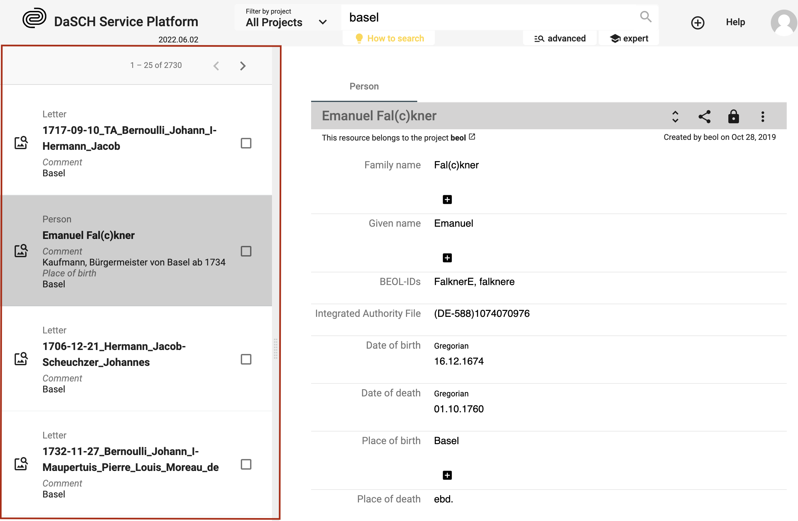

# Search results

<!-- ### Simple list -->
The results of the search are displayed in an organized list<!--with a small preview-->. You can select one result at a time to get more information.

*Search result 1: Simple list of results, similar to Google's list of results.*

&#9888;
It is not possible to sort or order by criteria when searching with the full-text search, use the advanced search or the expert search instead to get back sorted results.
<!--
---

### Grid list: Lighttable
&#9888; *NOT YET IMPLEMENTED*

The results of the search are displayed in a grid list with a big preview. You can select one result at a time to get more information.

*Search result 2: A preview list where the results are presented in tiles.*

---

### Table: Excel-like view
&#9888; *NOT YET IMPLEMENTED*

The search results are displayed in a table with the option to sort them. This layout is enabled when the search has been performed with **only one resource type**.
Each column of the table corresponds to one metadata.

*Search result 3: An Excel-like table view to edit multiple resources at once.*

-->
