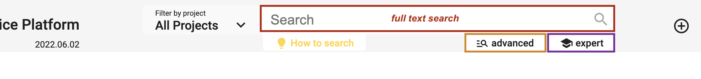
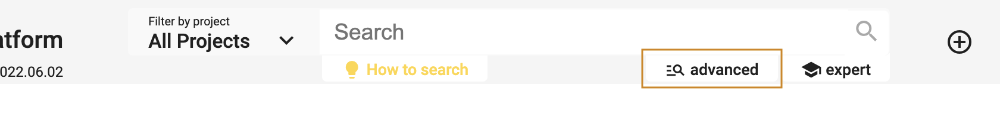
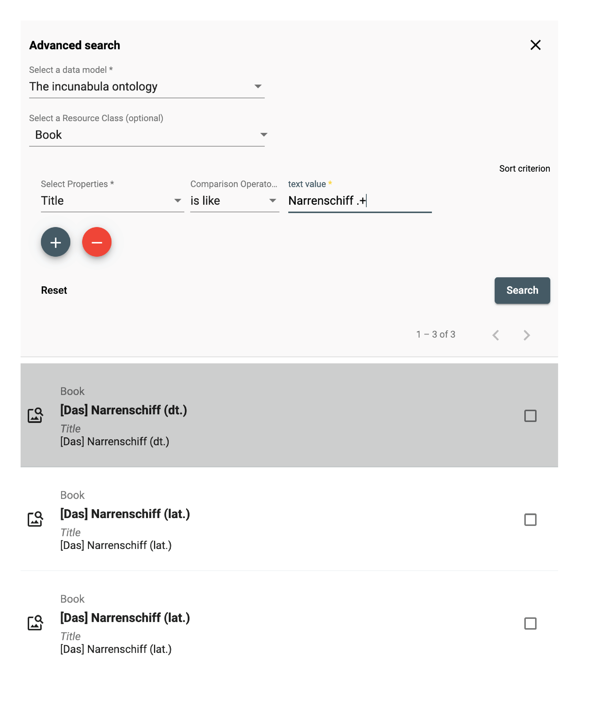
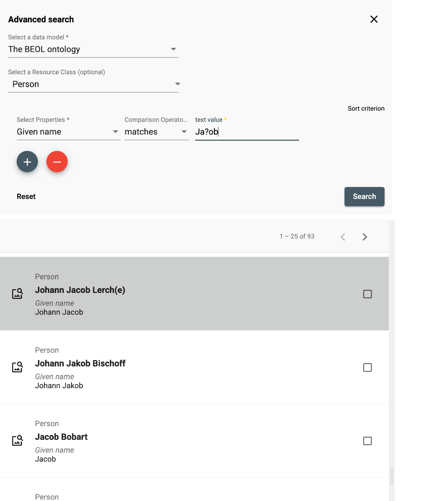
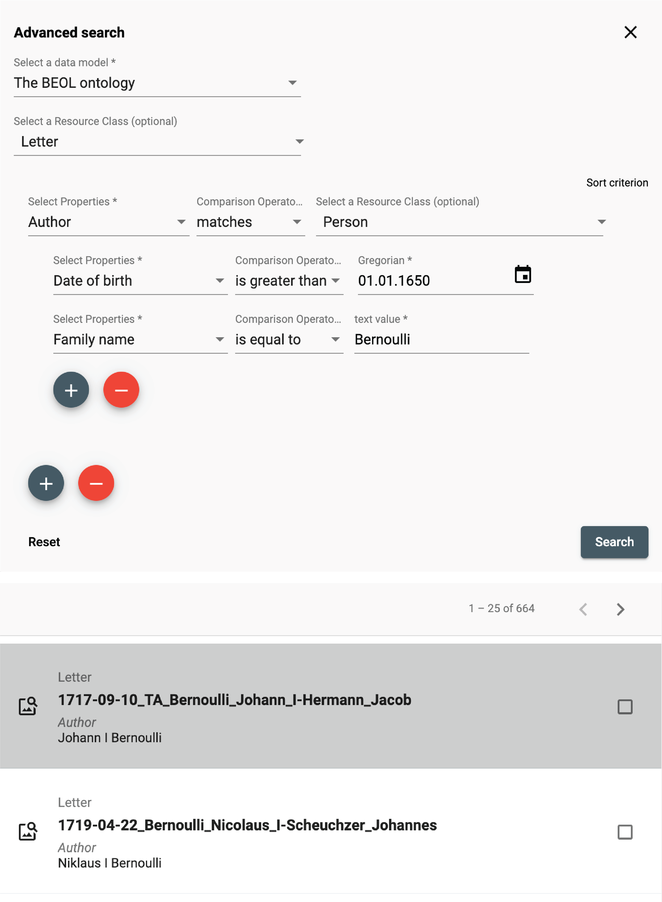
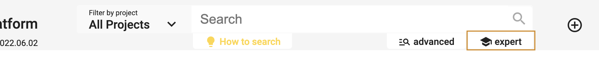

# Search and browse

DSP-APP offers the possibility for the user to search in 3 different ways: **full-text** search, **advanced** search, and **expert** search (Gravsearch query). The search bar is always available in the header of each page, whether logged in or out.

## Full-text search

The full-text search performs queries including one or more terms or phrases and returns data that matches the search conditions. By default, the search is performed in all projects stored in DSP. However, it is possible to filter by project using the "Filter by project" menu on the left side of the search bar.

*<https://admin.dasch.swiss> - Search 1: Full-text search*

When clicking on the search bar, the search history panel is displayed. The last **10** searches are registered. It is also possible to clear the search history list (*Clear list* button at the bottom of the panel or the *x* at the end of each line).

*Search history list is accessible for the full-text search from any webpage.*

Special syntax:

- question mark? can be used as a wildcard symbol for a single character.
- asterisk* can be used as a wildcard symbol for zero, one, or multiple characters.
- "quotation marks" searches for the whole pattern.

---

## Advanced search

The advanced search allows the creation of complex queries using a form.
The form creates a string representing a Gravsearch (SPARQL) query to be sent to DSP-API.

A query consists of the following elements:

- selection of the data model
- selection of a resource class belonging to the selected data model (optional)
- specification of properties, comparison operators, and values (optional).

Although the selection of a resource or a property or both are optional, either a resource class has to be selected or at least one property has to be specified, otherwise, the query is not considered valid and cannot be submitted.

*<https://admin.dasch.swiss> - Search 2: Advanced search offers many filter combinations and is a powerful search tool.*

### Comparison Operators

Depending on the value type of the chosen property,
one or more of the following comparison operators can be selected:

- `is equal to`: value equality: same number, exact same string, an overlap of date periods, same target resource.
- `is not equal to`: value inequality: not same number, not exact same string, no overlap of date periods, not same target resource.
- `is greater than`: value comparison: number is greater than search value, date period begins after search value.
- `is greater than or equal to` value equality/value comparison: number is equal to or greater than search value, an overlap of date periods or date period begins after search value.
- `is less than`: value comparison: number is less than search value, date period ends before search value.
- `is less than or equal to`: value equality/value comparison: number is equal to or less than search value, an overlap of date periods or date period ends before search value.
- `exists`: value for the given property exists.
- `is like`: search value is contained in a text using the SPARQL [REGEX](https://www.w3.org/TR/sparql11-query/#func-regex) function (supports regular expressions).
- `matches`:
  - text property: search value matches the text ([Lucene Query Parser Syntax](https://docs-api.dasch.swiss/08-lucene/lucene-query-parser-syntax/)).
  - linking property: matches the specified linked resource.

### Search Examples

#### is like (regular Expressions)

The `is like` operator lets the user search for texts that are *like* the search value via the support of regular expressions
In this example, all books are found whose title contains "Narrenschiff" followed by a space and some other characters like "(lat.)" or "(dt.)".

For general information about regular expressions, see this [interactive tutorial](https://regexone.com).

#### matches (Lucene Parser Syntax)

Used with a text property, the `matches` operator lets the user search for texts that *match* the search value,
supporting [Lucene Query Parser Syntax](https://docs-api.dasch.swiss/08-lucene/lucene-query-parser-syntax/).
In this example, all persons are found whose names contain "Ja" and "ob" with a character in between (represented by the wildcard "?").
This search finds "Jacob" as well as "Jakob".

**Note the difference between regular expressions and Lucene parser syntax!**

#### matches (specifying a Linked Resource)

Used with a linking property, the `matches` operator lets the user search for a linked resource that matches the specified properties.
In this example, the user writes a query looking for all letters that have an author that:

1. was born after January 1st, 1650
1. whose family name is "Bernoulli"

This is different from the "is equal to" operator that lets the user specify a certain person (selected from a list).

---

## Expert search

The expert search can be more powerful than the advanced search, but requires knowing how to use the query language Gravsearch (based on SparQL and developed by the DaSCH team). With Gravsearch, expert users can build searches by combining text-related criteria with any other criteria.

**For example**: you could search for a page in a manuscript that contains a certain element and also mentions a person, who lived in the same country as another person, who is the author of another author.

*<https://admin.dasch.swiss> - Search 3: Expert search is a text area in which you can create Gravsearch queries. Here is the default example you can find in the app.*

To learn Gravsearch, go to the DSP-API documentation [&rarr; Gravsearch](https://docs-api.dasch.swiss/03-apis/api-v2/query-language/)
