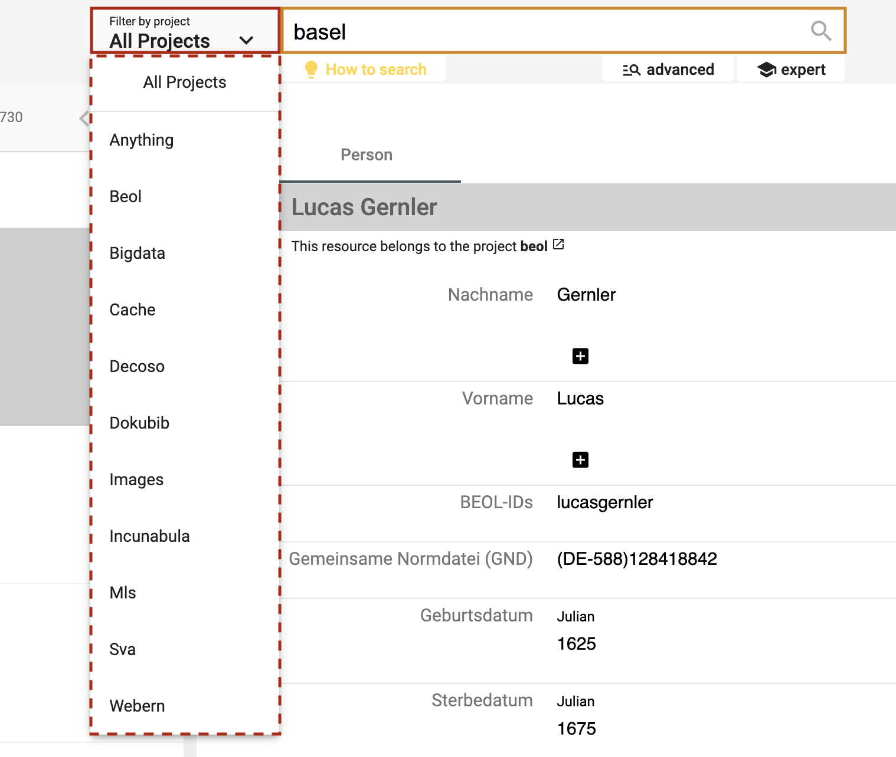
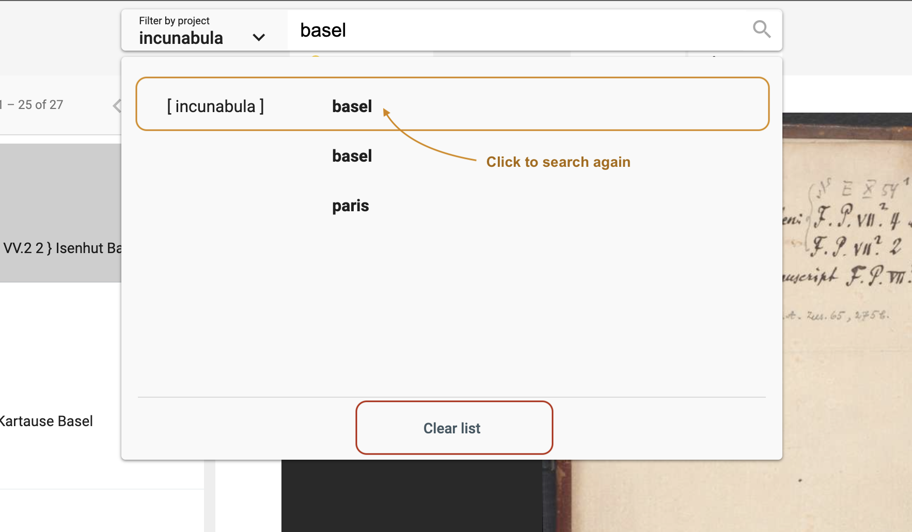
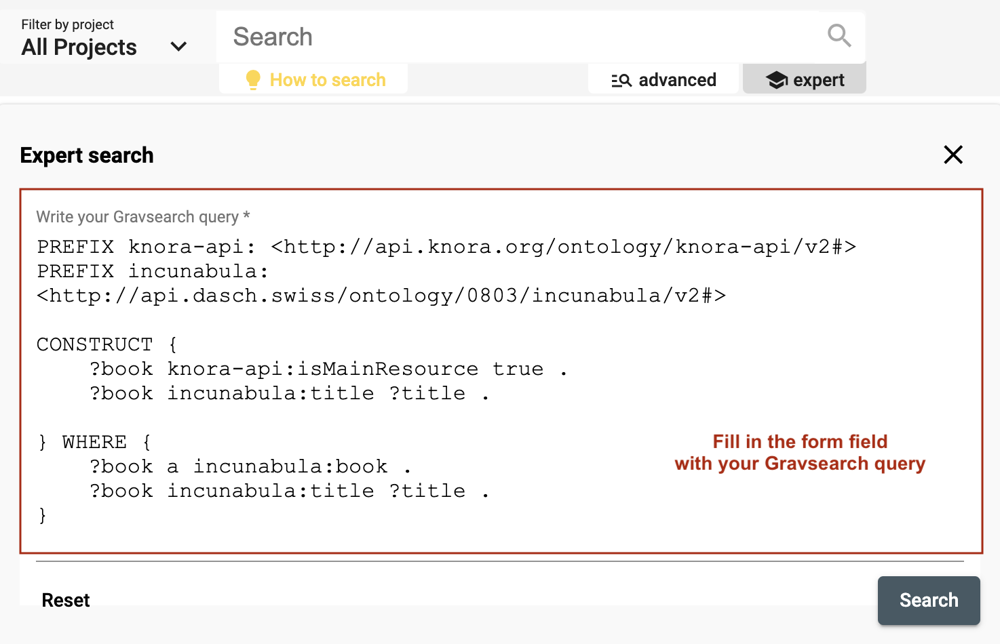

# Search and browse

DSP-APP offers the possibility for the user to search in 3 different ways: **full-text** search, **advanced** search, and **expert** search (Gravsearch query). The search bar is always available in the header of each page, whether logged in or out.

## Full-text search

DSP offers a full-text search that searches through all text values and labels of resources based on one or several terms (or phrase) entered in the search bar.
It returns data that matches the search conditions.
By default, the search is performed in all projects stored in DSP. However, it is possible to filter by project using the "Filter by project" menu on the left side of the search bar.

*<https://admin.dasch.swiss> - Search 1: Search in one specific project or all projects*

When clicking on the search bar, the search history panel is displayed. The last **10** searches are registered. Click on one search item to perform the same full-text search again. It is also possible to clear the search history list (*Clear list* button at the bottom of the panel or the *x* at the end of each line).

*Search history list is accessible for the full-text search from any webpage.*

### Search rules

- A search value must have a minimum length of **3** characters. If your search term has less than three characters (e.g. `is`), please add two asterisks (`*is*`).
- All terms are interpreted as **lowercase** characters. E.g. *My dearest Maria* is interpreted as *my dearest maria*.
- By default, the logical operator `OR` is used when submitting several search terms. I.e. the name `George Sand` is searched as `george` OR `sand`. The database will return all results that include the terms `George Sand`, `george`, or `sand`. To find the exact name `George Sand`, the term must be surrounded by quotes: `"George Sand"`.
- Each term separated by a **whitespace** is considered a single term. E.g. the term `mon petit chat` will be searched as `mon` OR `petit` OR `chat`. To find the exact phrase `mon petit chat`, the phrase must be surrounded by quotes: `"mon petit chat"`.

### Special syntax

Special characters can be used in order to search for specific text patterns.

Here is the list of characters with special meaning: `+, -, &&, ||, !, (, ), [, ], {, }, ^, ", ~, *, ?, :, \, /`

For more information about them, please read the [Lucene documentation](https://lucene.apache.org/core/7_7_0/queryparser/org/apache/lucene/queryparser/classic/package-summary.html).

> If you want to search for these special characters **explicitly**, note that the punctuation marks `,` and `.` are **NOT** eliminated and stay with the term where they occur. E.g. `To be, or not to be, that is the question.` -> when searching for `be` the term `be,` (comma included) won't be found (and thus also not the entire phrase). We recommend to use the special character `*` - thus `be*` - to find all occurrences of a term.
Another example: If you search for the term `(1995)` that includes parenthesis in this case, you have to search for `*1995*`.

**Focus on the most common used characters:**

- `*`: The **askerisk** can be used as a wildcard symbol for **zero, one, or multiple characters**. E.g. `pari*` will yield results such as `Paris`, `Parisian`, `parity`, `parish`, etc.
- `?`: The **question mark** can be used as a wildcard symbol for a **single character**. E.g. `Bern?` will yield results such as `Berne`, `Bernt`, etc.
- `""`: **Quotation marks** allow searches for the **whole pattern**. E.g. `"vittāni agne"` yields a result for the exact term `vittāni agne`. If your search term consists of more than one word and you intend to do an `AND` search, please use quotation marks.

In order to make searching easier and independent of special characters, we recommand to use the advanced search. It will narrow down the search and accept special letters or characters. E.g. the exact writing `rāmāyaṇī` will be accepted and found.

### Include special characters in the search

If one of the above characters should be included in the search - without any special meaning - it needs to be escaped by the character `\` .

E.g. If you want to search for *Notre-Dame de Paris*, you should type `"Notre\-Dame de Paris"`.

### Conversion

Alphabetic, numeric, symbolic, and diacritical Unicode characters which are not part of the [first 127 ASCII characters](https://learn.parallax.com/support/reference/ascii-table-0-127) (the "Basic Latin" Unicode block) are converted into their ASCII equivalents, if one exists. Thus, the full text search is set such that e.g. `é`, `ä`, `š` are converted into `e`, `a`, and `s`. This means that a search for `šumma` will yield results for `šumma`, `summa`, `ṣumma`, `śumma`, etc. If this is not what you need, please use the advanced search option instead.

For special characters that cannot be converted to ASCII equivalents, we suggest to replace the respective special character by an **asterisk**:
Such an example is `r̥tasya`, where the `r̥` must be replaced either by `rr` or - simpler - by `*`: thus searches for `rrtasya` or `*tasya` will yield the intended search result, but not `rtasya`.

---

## Advanced search

The advanced search allows the creation of complex queries using a form. The advanced search can be accessed from the data browser of any project.
The form creates a string representing a Gravsearch (SPARQL) query to be sent to DSP-API.

A query consists of the following elements:

- selection of the data model (if you have more than one data model within your project)
- selection of a resource class belonging to the selected data model (optional)
- specification of properties, comparison operators, and values (optional).

Although the selection of a resource or a property or both are optional, either a resource class has to be selected or at least one property has to be specified, otherwise, the search button stays inactive.

### How do I sort the search results?

You can open the "Order by" dropdown, by selecting the checkboy of the property, you specify that it will be sorted by. The order of the entries determines which criterion should be used for sorting first. You can reorder them by clicking and dragging them.

<https://github.com/dasch-swiss/dsp-das/assets/136320187/e43bb484-91b9-48ad-a59d-0e7c79a4df1b>

### Comparison Operators

Depending on the value type of the chosen property,
one or more of the following comparison operators can be selected:

- `is equal to`: value equality: same number, exact same string, an overlap of date periods, same target resource.
- `is not equal to`: value inequality: not same number, not exact same string, no overlap of date periods, not same target resource.
- `is greater than`: value comparison: number is greater than search value, date period begins after search value.
- `is greater than or equal to` value equality/value comparison: number is equal to or greater than search value, an overlap of date periods or date period begins after search value.
- `is less than`: value comparison: number is less than search value, date period ends before search value.
- `is less than or equal to`: value equality/value comparison: number is equal to or less than search value, an overlap of date periods or date period ends before search value.
- `exists`: value for the given property exists.
- `not exists`: value for the given property doesn't exist.
- `is like`: search value is contained in a text using the SPARQL [REGEX](https://www.w3.org/TR/sparql11-query/#func-regex) function (supports regular expressions).
- `matches`:
    - text property: search value matches the text ([Lucene Query Parser Syntax](https://docs.dasch.swiss/latest/DSP-API/07-lucene/lucene-query-parser-syntax/)).
    - linking property: matches the specified linked resource.

### Search Examples

#### is like (regular Expressions)

The `is like` operator lets the user search for texts that are *like* the search value via the support of regular expressions
In this example, all books are found whose title contains "Narrenschiff" followed by a space and some other characters like "(lat.)" or "(dt.)".

For general information about regular expressions, see this [interactive tutorial](https://regexone.com).

#### matches (Lucene Parser Syntax)

Used with a text property, the `matches` operator lets the user search for texts that *match* the search value,
supporting [Lucene Query Parser Syntax](https://docs.dasch.swiss/latest/DSP-API/07-lucene/lucene-query-parser-syntax/).
In this example, all persons are found whose names contain "Ja" and "ob" with a character in between (represented by the wildcard "?").
This search finds "Jacob" as well as "Jakob".

**Note the difference between regular expressions and Lucene parser syntax!**

#### matches (specifying a Linked Resource)

Used with a linking property, the `matches` operator lets the user search for a linked resource that matches the specified properties.
In this example, the user writes a query looking for all letters that have an author that:

1. was born after January 1st, 1650
1. whose family name is "Bernoulli"

This is different from the "is equal to" operator that lets the user specify a certain person (selected from a list).

---

## Expert search

The expert search can be more powerful than the advanced search, but requires knowing how to use the query language Gravsearch (based on SparQL and developed by the DaSCH team). With Gravsearch, expert users can build searches by combining text-related criteria with any other criteria.

**For example**: you could search for a page in a manuscript that contains a certain element and also mentions a person, who lived in the same country as another person, who is the author of another work.

*<https://admin.dasch.swiss> - Search 3: Expert search is a text area in which you can create Gravsearch queries. Here is the default example you can find in the app.*

To learn Gravsearch, go to the DSP-API documentation [&rarr; Gravsearch](https://docs.dasch.swiss/latest/DSP-API/03-endpoints/api-v2/query-language/)
