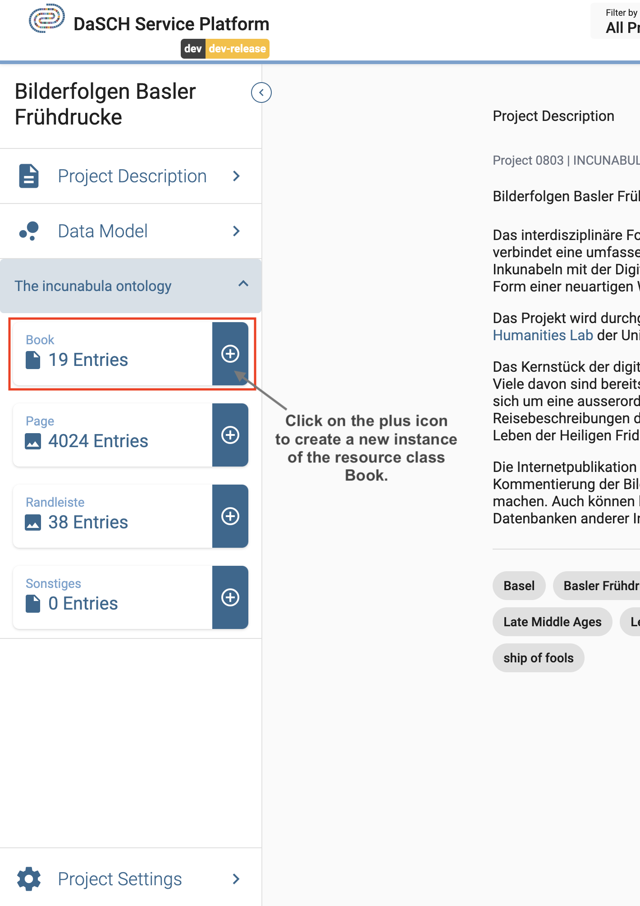
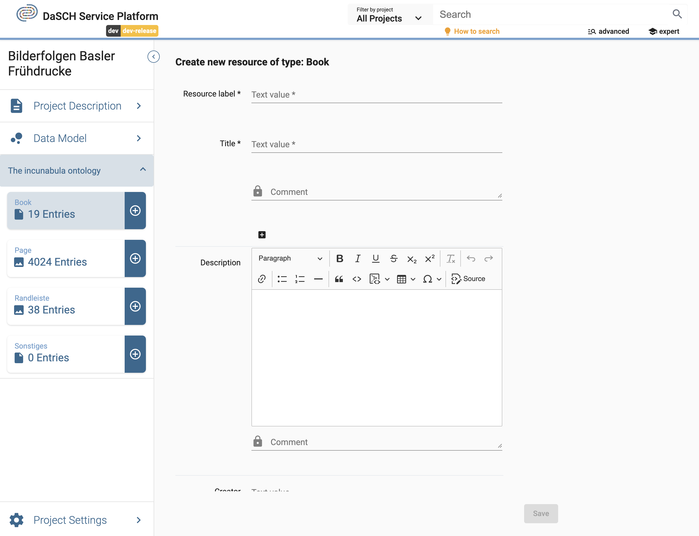

# Data management

Once your [data model](https://docs.dasch.swiss/latest/DSP-APP/user-guide/project/#data-model) is ready, you're able to add data. The DSP-APP offers several possibilities to add data, whether you are starting from scratch or importing data from another program.

## Start from scratch

When a project starts from scratch, you will enter and generate new data directly in the DSP-APP itself. Generating new data can be done one by one with a form at the moment:

- Upload files, e.g., an audio file, photography, a video, or a document
- Augment the metadata

### Create new resource instances

To create a new resource instance, you go to your project workspace and find the desired resource class in the side panel from which you want to create a new instance.

*Your resource classes are listed in the side panel of your project workspace.*

Fill in the form and upload the file if requested (depending on the type of resource). Please, note that the required fields are marked with an asterisk `*` after the property label. Click on `Save` to create the new resource instance. If you cannot click on `Save`, it means that a required field has not been filled in.

*Create a new resource instance e.g. a book*

> Please, note that the image, video, and audio files must be in one of the required file types supported by the database. The supported types are listed in the upload section of the form.
