# Work on your data

Once you have found the desired resources, you can (re)view them and annotate the resource itself, the media file, or single metadata values. If you select more than one resource, you can compare them in a side-by-side view or link them.<!--edit them all at once, or save them in a collection. A collection is similar to a playlist in a music app or shopping basket in an online store-->

## Data permissions

In order to know what you are allowed to see or do with the selected resource, please check the permissions that are granted for your user role. You can find more details about the [permissions in the documentation of DSP-API](https://docs.dasch.swiss/latest/DSP-API/02-dsp-ontologies/knora-base/?h=permission#permissions).

If you don't have the permissions you were supposed to get, please contact the [DaSCH team](mailto:support@dasch.swiss).

*Check the resource permissions you are granted.*

## Display data

### Display a resource

DSP-APP offers different resource views for different media types (images, videos, audio, archives, text, and document files). You can access the resources from the list of search results. Depending on the media type, DSP-APP offers different tools to work on the resource.
Additionally, you can work on the resource directly, e.g, mark regions of interest on images and documents.

Each media viewer offers different tools and functionalities, either displayed in the bottom toolbar (e.g. zoom, open in fullscreen button, play button, etc. - captioned in orange thereafter) or in the menu - the three-dot button on the bottom-left side (e.g. copy the ARK URL to the clipboard, download/replace the file, open the file in a new tab - captioned in red thereafter).

*Single resource view. The resource type in this example is "Page" and an image viewer displays the photograph of the manuscript page.*

Everything about the resource is displayed below the media viewer (when there is one). All the information about the resource itself (e.g. type, label, permissions, creator, date of creation, etc.), the data (properties and values), and different functionalities such as editing, deleting, sharing the resource. You can find more information about the functionalities in the following sections.

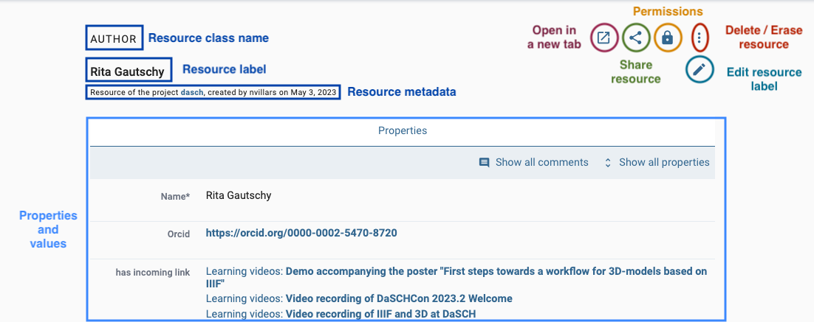

#### Audio file

Supported file types: **mp3**, **wav**

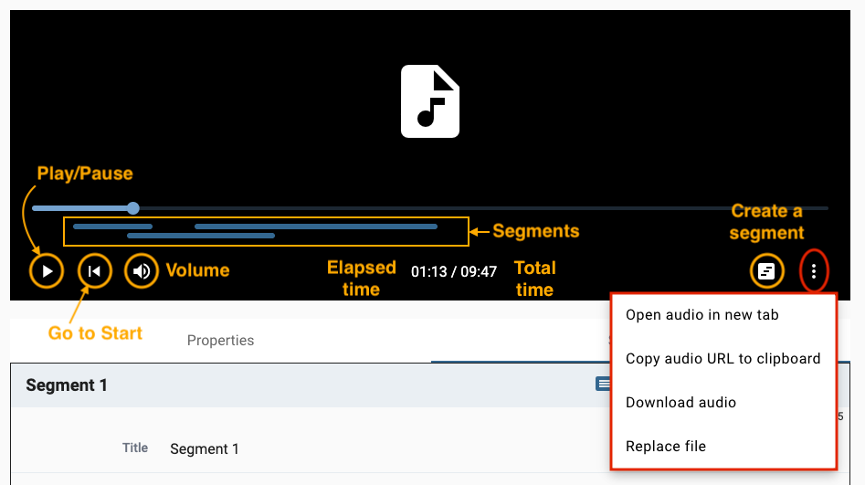

#### Image file

Supported file types: **jpeg**, **jp2**, **jpg**, **tiff**, **tif**, **png**

In a resource of type "still image", you're able to draw regions on the image and annotate this region. Usually, a still image resource is used for book pages, photographs, postcards, letters, etc.

When you open a resource that contains an image, it is displayed in a viewer. Several functionalities are accessible from the image viewer, e.g. zoom in/out, copy the IIIF link, replace the image or draw a region on the image.

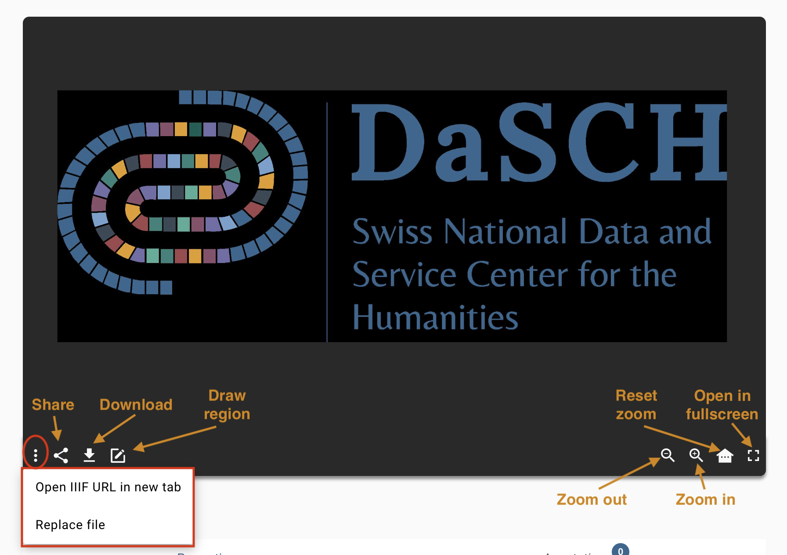

For users without permission to see a restricted image, a notification will warn them at the top of the image viewer.

To access the regions, go to the **annotation** panel. You can **click on an existing region** in the image viewer, the focus of the page will be redirected to the annotation information.

*Access the annotation panel from the resource toolbar.*

#### Document file

Supported file types: **pdf**, **doc**, **docx**, **xls**, **xlsx**, **ppt**, **pptx**

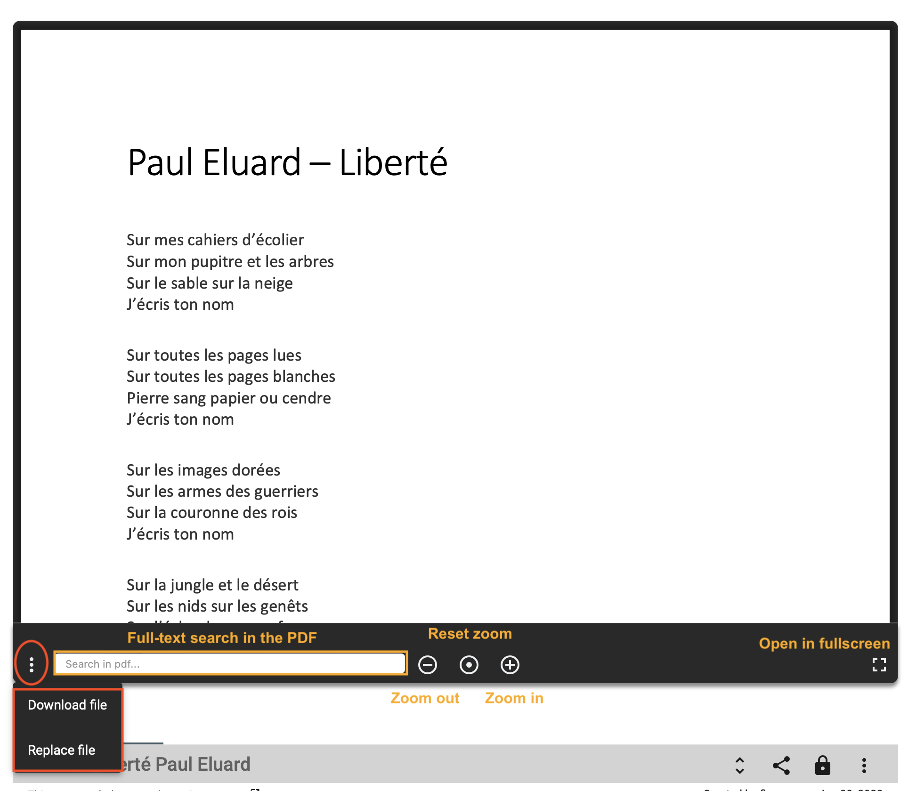

#### Text file

Supported file types: **csv**, **txt**, **xml**, **xsd**, **xsl**

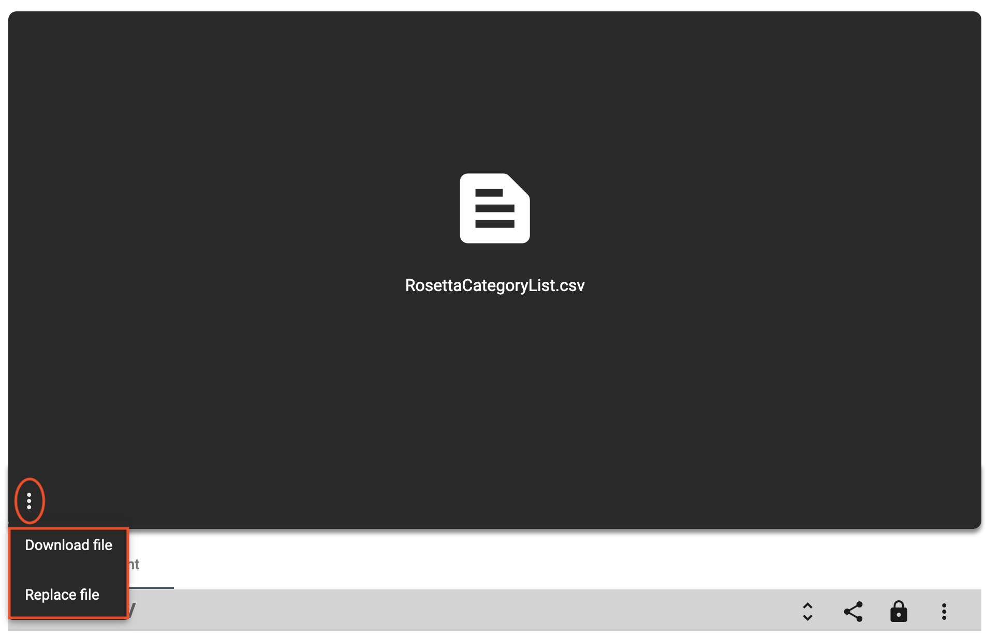

#### Video file

Supported file types: **mp4**

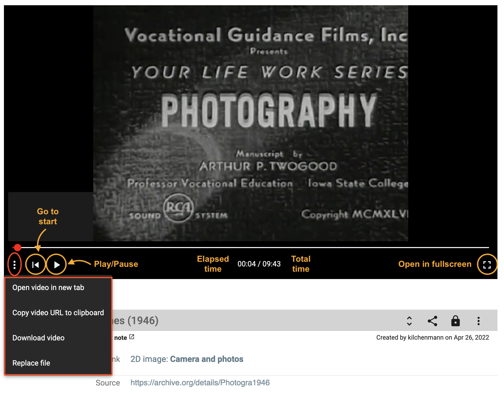

#### Archive file

Supported file types: **7z**, **gz**, **gzip**, **tar**, **tgz**, **z**, **zip**

### Display resource properties

By default, only important properties are shown in the resource viewer. To display them all, click on the "unfold" button in the resource toolbar.

*Show or hide properties from the toolbar.*

To get more information about the property value, i.e. date of creation and author name, hover over the value and then over the info button.

*Get the creation date and the author name of the value.*

### Display a value comment

To display the existing value comment, hover over the property value and click on the comment button (3rd icon from the left).

*Hover over the property value to see if there is a comment and display it.*

---

## Display and compare several resources

You can compare 2 or more resources of any type at the same time side by side. From the search result list, select your resources of interest by checking the checkbox (right side of each result) and clicking on the compare button on the right-side tile.

*Example: Select 3 resources and compare them.*

To keep in mind: The more you compare, the smaller the resource viewer for each will be. You can deselect one or more resources to remove them from the compare viewer.

*Visualise your selected resources side-by-side. You can compare 2 images with an object without representation for instance.*

---

## Add new data

&#9888; You must have the granted permission to proceed.

### Add a resource

See section [Create new resource instances](./start.md#create-new-resource-instances).

### Add a property value

You can create a new property value **if your data model allows it**. The value should have a cardinality of 0-1, 0-N or, 1-N.
A "plus" button is displayed to the right of the label or after the first value field. You fill in the form field and save the changes by clicking on the floppy disk button. You can undo (back arrow button) or cancel the changes (x button).

*Add a new property value.*

*Save or undo the changes you made.*

If your property is linked to another resource, you can search for an existing value by typing the first three letters of the resource label you are looking for. You can also create a new resource instance by clicking on the first option in the drop-down menu, `Create new: xxx`.

### Add an image region

To create a new region on an image, you click on the button `Draw a region` in the toolbar, then select the region you want on the image.

*Select a region on the image with the drawing tool.*

Enter the information about the region, an informative label and a description as a comment. You can change the color.

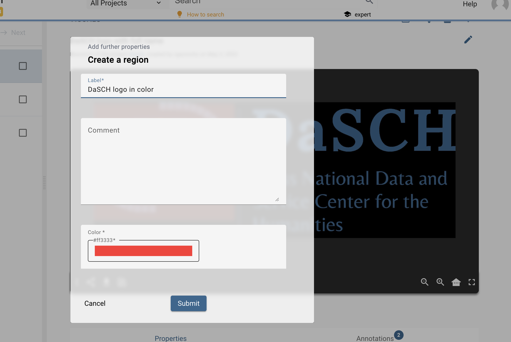*Fill in the form about the selected region.*

The new region information is displayed after the image viewer. You can edit or delete if you have the granted permissions. A region has also an AKR URL you can copy and share.

*A new region has been created.*

---

## Edit your data

&#9888; You must have the granted permission to proceed.

### Edit a resource

To edit the resource label, open the resource menu on the right-side of the toolbar and click on `Edit label`.

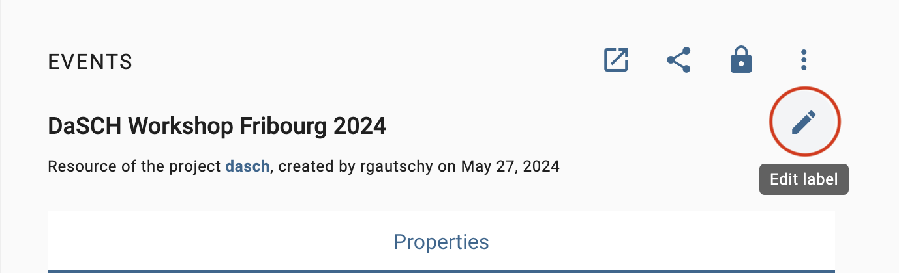

### Edit a property value

You can edit a property value from the resource viewer. Hover over the value and click on the edit button.

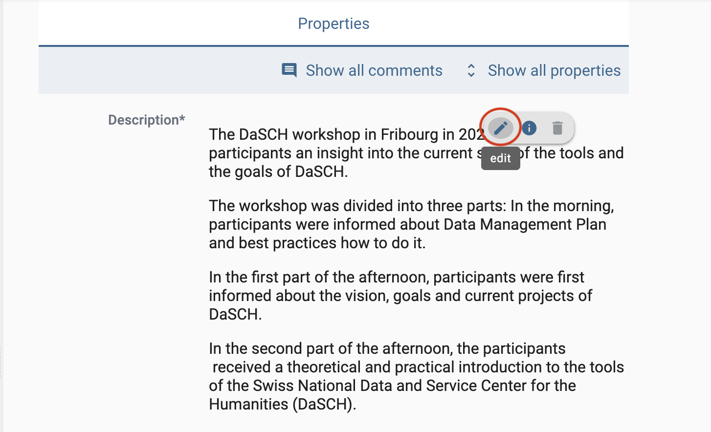*Edit button when mousing over the value.*

You edit your value by changing the text content, searching for another resource label, or creating a new resource instance. Don't forget to save your changes (floppy disk button) or undo them (back arrow button) to leave the edit mode.

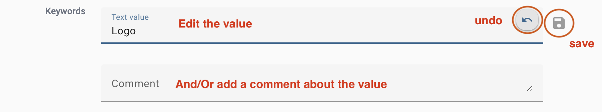

It is the same process to add, edit or delete a comment to the value.

---

## Delete your data

&#9888; You must have the granted permission to proceed.

### Delete or erase a resource

To delete a resource, there are 2 possibilities:

1. **Delete** resource: the resource is not searchable or findable in DSP-APP anymore but the data still exists in the database.
2. **Erase** resource: the resource is **permanently** deleted from the database, it will be impossible to get it back.

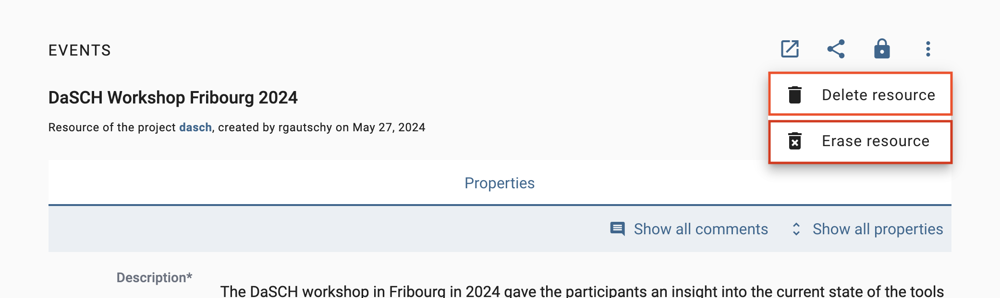*Delete or erase a resource.*

### Delete a property value

You can delete a property value. Hover over the value and click on the delete button. You have to confirm your choice. It is possible to comment on the deletion of the value in the confirmation pop-up window to explain why it is being deleted.

*Delete a property value.*

---

## Annotate and link data

The main feature of the flexible data storage that DSP-APP uses is the possibility to annotate and link resources and their metadata. An annotation can be a small note about a date like "Not sure about the birthdate of this person. There's another date mentioned in the resource XYZ". Inside the note, it will be possible to link to another resource.

Links in DSP-APP are always bi-directional. If you link resource A with resource B, then resource B knows about this connection. If you find resource B, you have the connection to resource A as well.

It is possible to link resources of the same project or from 2 different projects.

DSP-APP offers two ways to link data:

1. Internal linkage: it allows you to create a direct link between 2 resources. The label of the linking resource (source) will appear in the „incoming links“ section of the targeted resource. You will choose this option when you want to embed the link in a text.

2. Link object:  it allows you to create an annotation (the description of the link object) that can point to one or more resources. You will prefer this option if you want the link to exist and describe it.

### Internal linkage

To link 2 resources (A is an image and B is a document in the example), you go to your resource A that will be linked, open the **Share** menu and click on the button `Copy internal link on clipboard`. You have copied the internal link of your resource A that will be used to make the link with your resource B.

*Copy the internal link of the resource A.*

Go to your resource B. You click on the **edit** button of the property value where you want to add the link (by hovering over the value content). This value must be of type **rich text**.

*Edit the property value of type rich text to add the link.*

You write and select a word or a group of words you want to attach the link to, then click on the **Link** button in the toolbar of the text editor, paste the internal link of resource A here, and click on **Save**.

*Add the link in your text and save.*

The word (or the group of words) is now highlighted in blue-grey and is clickable.

*The link has been added to your text.*

### Link Object

To create a link object, the process starts from the search result list. You select 2 or more resources from the list and click on the button Create a link object from this selection.

*Select the resources to link.*

You fill out the form indicating the project in which you want to register the link object, as well as a label to identify it. Optionally, you can add a comment (annotation) to describe this collection of resources. Then, click on Create.

*Fill in the form about the new link object.*

The linked resources are listed in the `has Link to` property of the link object resource viewer. The label of your link object is searchable through a [full-text search](./search.md#full-text-search).

It is possible to add other resources later on by clicking on the `+` button in the `has Link to` property section.

---

## Share your data

Each resource of your dataset gets an ARK URL (Archival Resource Key), a persistent identifier that will allow you to permanently cite your resource in papers, conference presentations, books, etc.

You will find it in the **Share** menu of the resource toolbar, click on `Copy ARK to clipboard` to copy and paste it wherever you want.

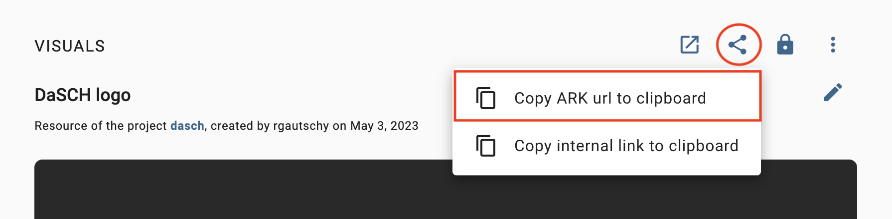*Copy ARK URL.*
