# Project Administration

## Project

Once you are [logged in](/user-guide/#login), the dashboard displays the list of your project(s). If you are a project administrator or a system administrator, you can edit the project information or archive your project from the project menu. Archived projects are stored in a list on your dashboard and they can be "reactivated" at any time.

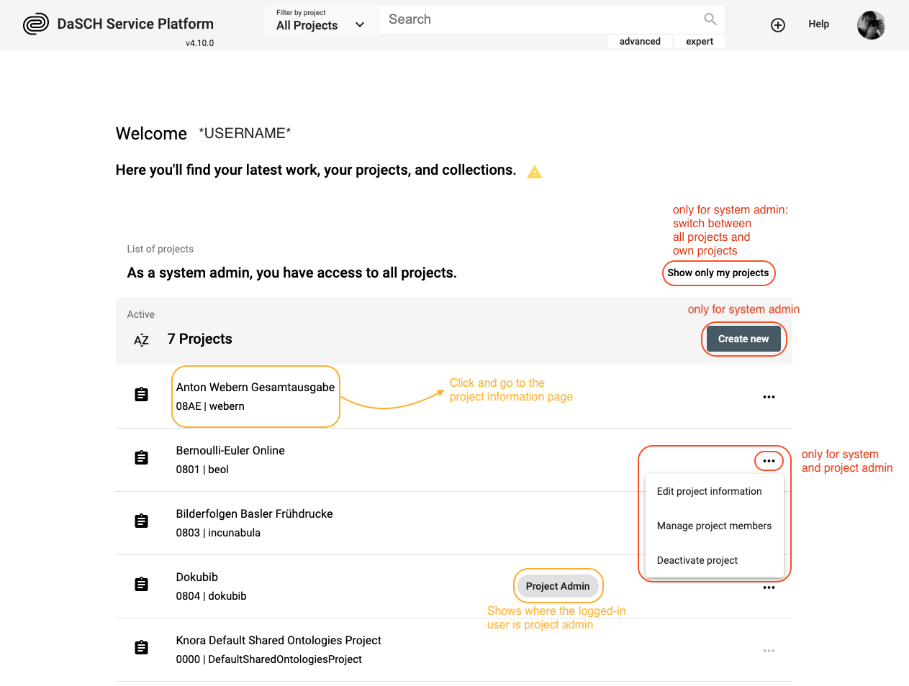*<https://admin.dasch.swiss/dashboard> - By clicking on the project name, you get access to the full project information.*

A system administrator can create a new research project. This currently requires essential information such as the project name, a shortcode and a shortname (both provided by DaSCH). A short project description is optional, but highly recommended.

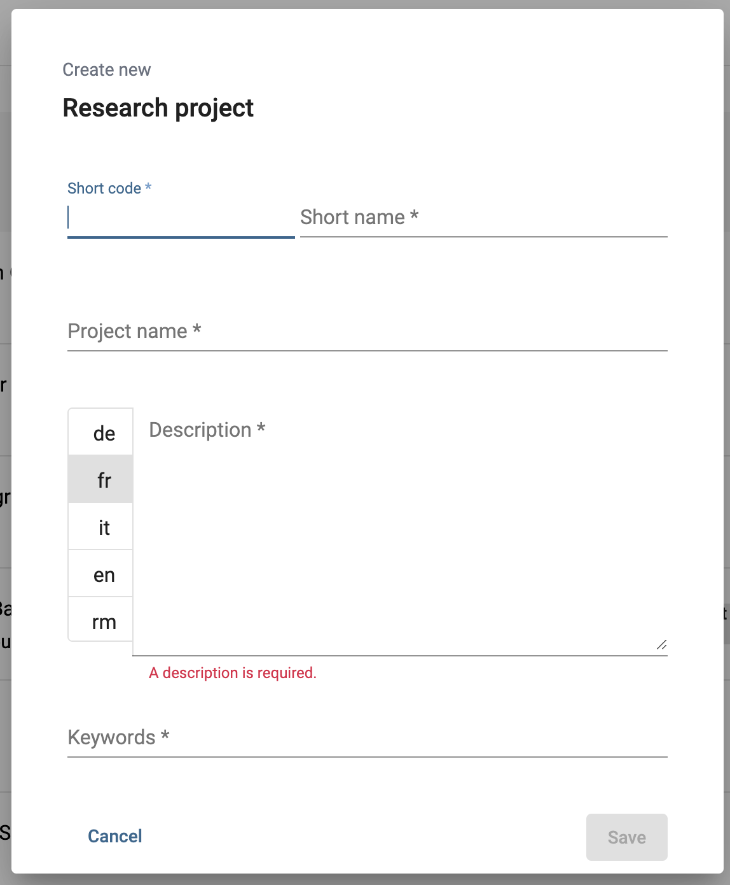
*Form to create a new project.*

As project administrator or system administrator, you can define your project, add your team members, create permission groups and - most important - define your data model (ontology) and the lists of your project.

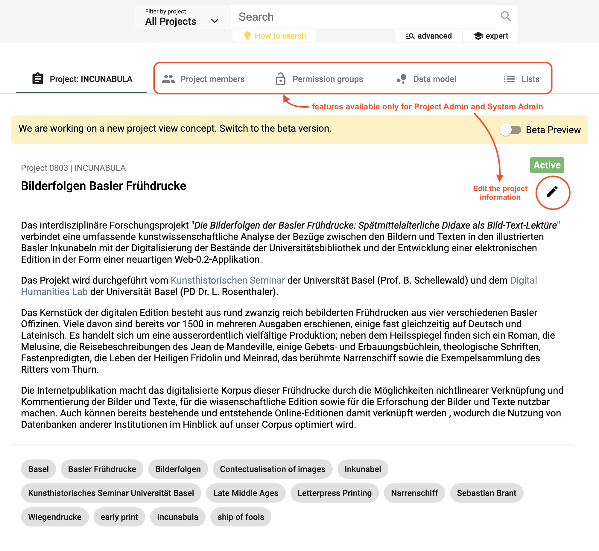*<https://admin.dasch.swiss/project/0803/info> - Project management functionalities; e.g. Incunabula project. Project information page is displayed without restricted content, the other functionalities are reserved for project admin and system admin.*

---

## Collaboration

As a system administrator, you can add users as project members and define their permissions roles: *Who is able to edit or to see your project data?* Data includes the research sources and their metadata. [Permissions](/user-guide/project/#permission-groups) can be set for the entire project or for single metadata fields. 

A user menu with different actions is accessible for each member of the project (link to the right side of the user line). The admin can appoint another user as project admin (or remove this permission), edit user's information, change user's password if forgotten, and remove a user.

*<https://admin.dasch.swiss/project/0803/collaboration> - Collaboration page where project admin and system admin can add new user to the team.*

> **_NOTE:_** **Permissions for project admins to add new users as project member will be implemented soon.**

---

## Data model

The definition of the data model (*ontology*) is the most important step. The data model is indispensable for structuring your data. Our platform provides a tool for an easy creation of one or more project data models. First, you have to know which data and sources you want to work with. The data model can be flexible and customizable. 

The question which you have to answer before you create your data model is **according to which criteria do you organize your data**? In this respect it may be useful to ask yourself:

- *How are your data organized?*
- *What are the goals you want to achieve, which research questions do you want to answer?*

As soon as you have come to a conclusion concerning the structure of your data, you're all set to create your data model.

### Create your data model

**Go to *Data model* and click *New data model***

Go to your project, select the tab `Data model` (step 1) and click the button `New data model` (step 2) as shown below:

By clicking `New data model`, a dialogue box opens:
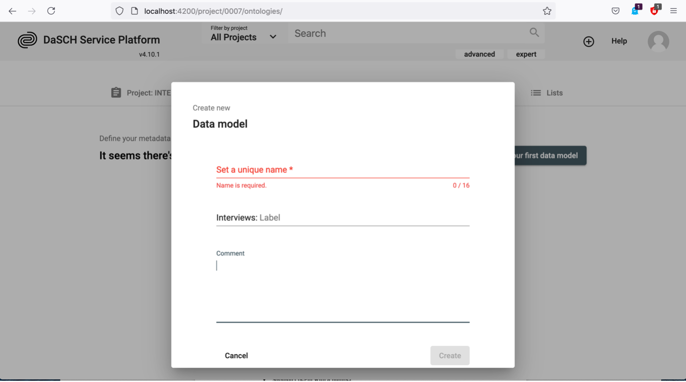

**Create data model**

Now you've to set a unique name (*please consider the NOTE*) and you can add a comment. Push the button `Create` to create your data model.

> **_NOTE:_***There are some rules for the unique name:*
>
> - *must be at least 3 characters long*
> - *shouldn't start with a number*
> - *shouldn't start with the letter v and a number*
> - *spaces or special characters are not allowed*
> - *may not contain these reserved terms:*
>   - *knora*
>   - *ontology*
>   - *salsah*
>   - *shared*
>   - *simple*
>   - *standoff*
> - *the unique name can't be changed afterwards!*

*The label is a combination of the project's shortname and the unique name. You can replace it with any other string.*
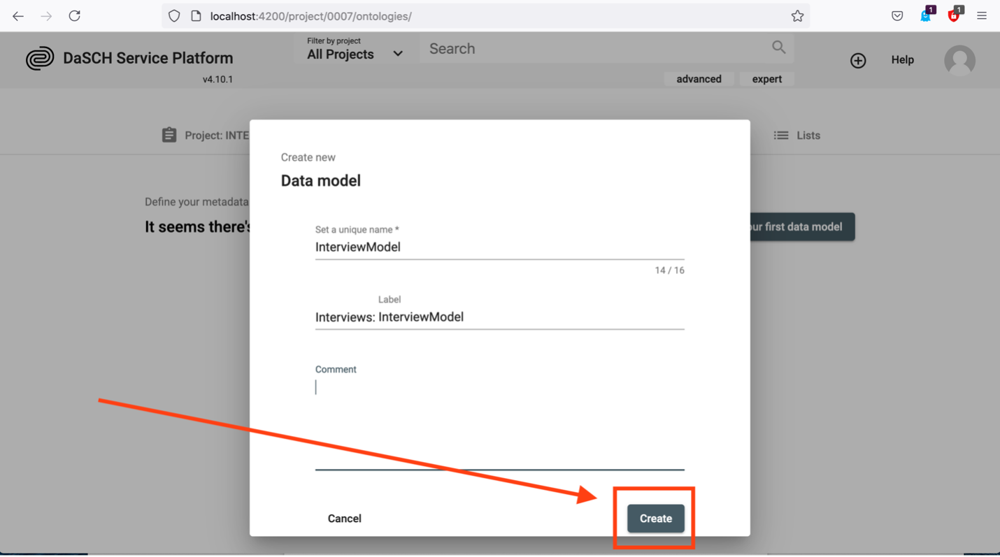

After the creation of your data model, your page should look like this:
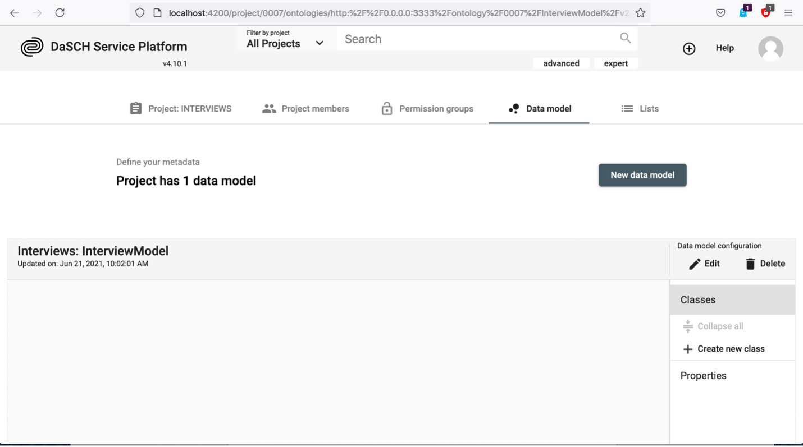

---

### Create resource CLASSES

You can then create a resource class by clicking the button `+ Create new class`:
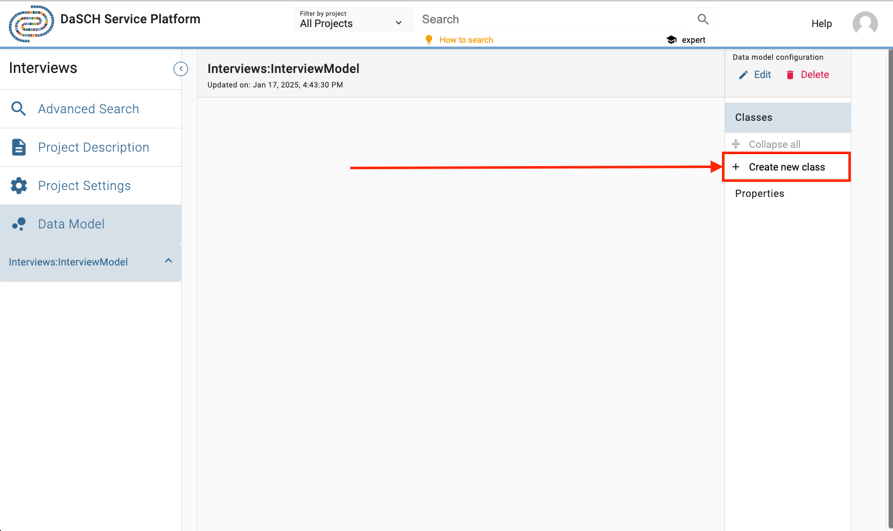

By clicking `+ Create new class`, a small window pops up with six basic types to choose from:
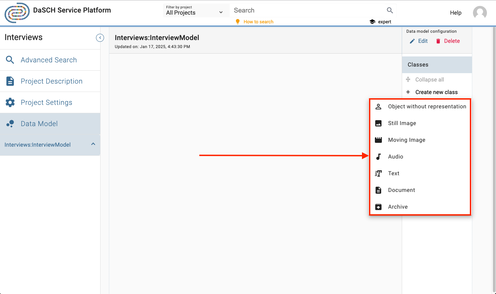

Which type you choose depends on the data type which you need to describe. Let's assume you have pdf-documents of books and they have a number of pages. To describe this in an ontology, you create a class as `Document` by clicking on `Document`. A dialog box pops up which looks like this:
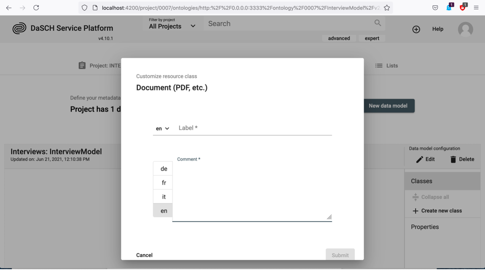

As label you could write *Book*, and you should add a preferably meaningful comment in at least one of the predefined languages English (en), German (de), French (fr) or Italian (it). Then click the `Submit` button:
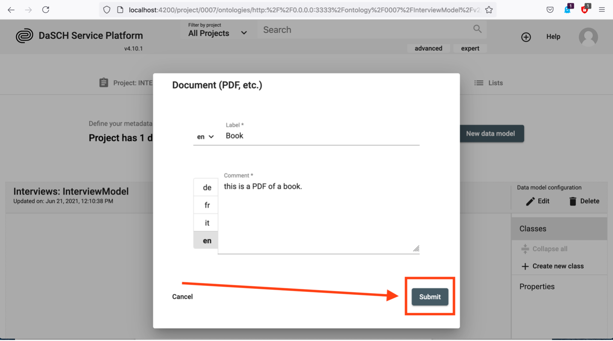

Now you have created your first class *Book*, as seen below:
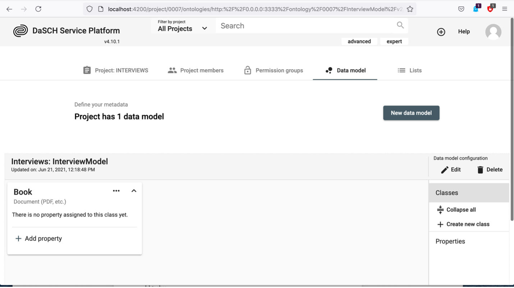

---

### Add PROPERTIES to a resource class

Now you can add properties to your class. Your pdf of a book has a number of pages. Hence, it may be useful to define the number of pages as one of the properties of your class *Book*. Click on `+ Add Property` in the *Book* box:
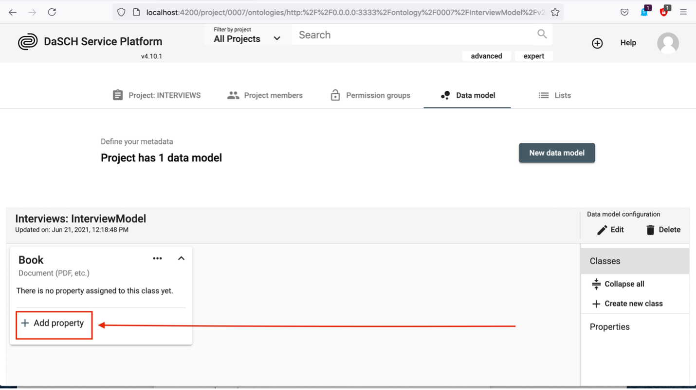

Theoretically, you have two options now. If you defined properties before, you may simply add them here (second option in the following image). If you just start adding properties, you have to choose `Create new from type`.
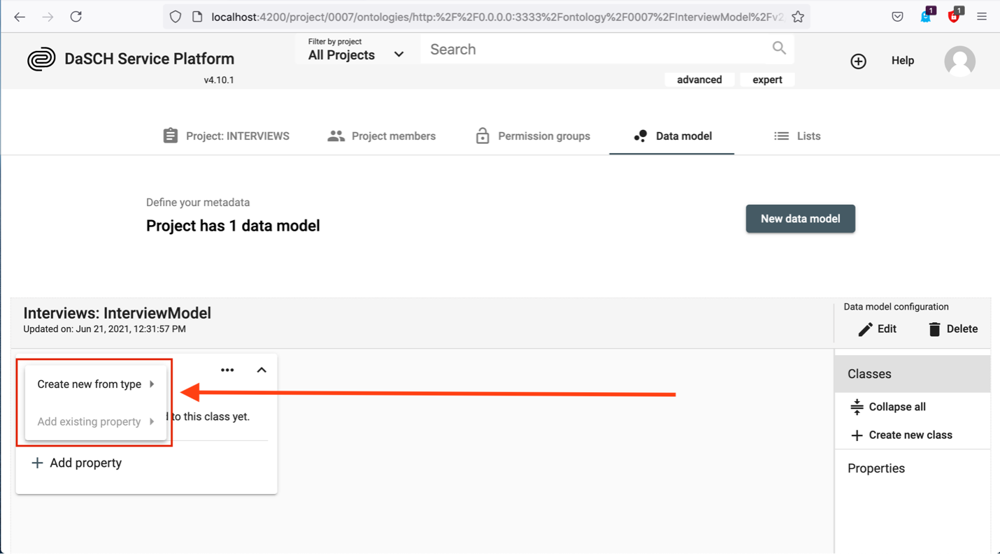

By hovering over `Create new from type`, a new dialogue box appears:
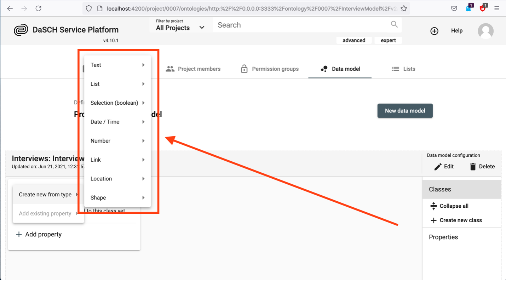

You can choose from a selection of the following basic types with various subtypes:
- Text (*Short*, *Paragraph*, *Rich Text*)
- List (*Dropdown*)
- Boolean (*Yes/No* selection; checkbox)
- Date / Time (*Date*, *Timestamp*, *Time sequence*)
- Number (*Integer*, *Decimal*)
- Link / Relation (*Resource Class*, *External URL*)
- Location (*Place*; a [geonames-identifier](https://www.geonames.org/))
- Shape (*color*)

Since in our example you want to add a property for the number of pages of your book, you choose `Number`. Now you will see that you can either choose the type `Decimal` or `Integer` for your property. 
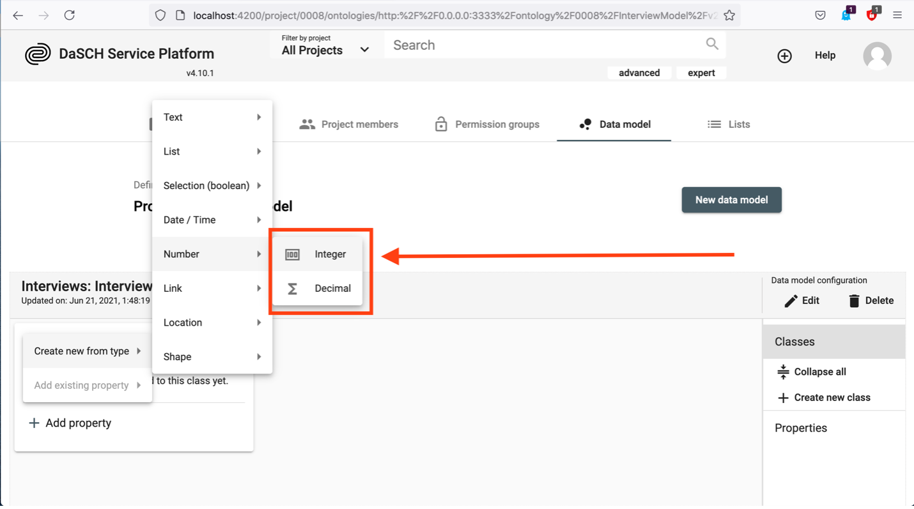

Page numbers have no decimal places, thus you will selecet `Integer` as type for your property. The following window pops up:

In the field *Property label* add for example *Number of pages*, in the comment section you should add a meaningful explanation. It might also make sense to toggle `Required field?` since every PDF Document consists of a number of pages. If you toggle it, the number of pages MUST be given if you add data to the class *Book* - it would then be a required field, not an optional one and data could only be saved if you add the number of pages.

If you want to define a property which can have more than one value, you should tick `Multiple values?`. For the number of pages of a book this does not make sense, but in the case you want to define a property describing which people are mentioned in your *Book*, the option multiple values is likely to be needed.

Now you should see the new property in the box as seen below:
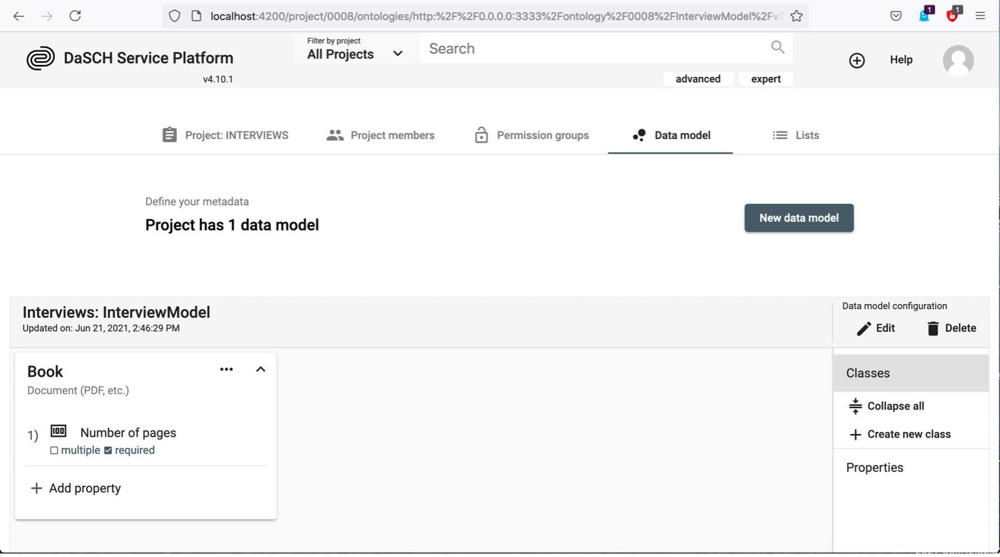

### Define Lists
One of the possible property types to choose from is *List*. Lists are very useful if you want to use controlled vocabulary to describe something. Typical examples are keywords. In your book example it may be useful to define a property which describes to which category of literature your pdf of a book belongs. **Before** you can add a property of type *List* to your data model, you have to define this list. For the definiton of a list you have to change to the `Lists` tab:
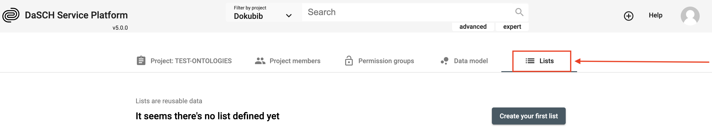

Click `Create your first list`. If there is already a list defined, click `New list`. A new window pops up where you have to enter a name for your list (`List label`) and a short description, then click `Create`.
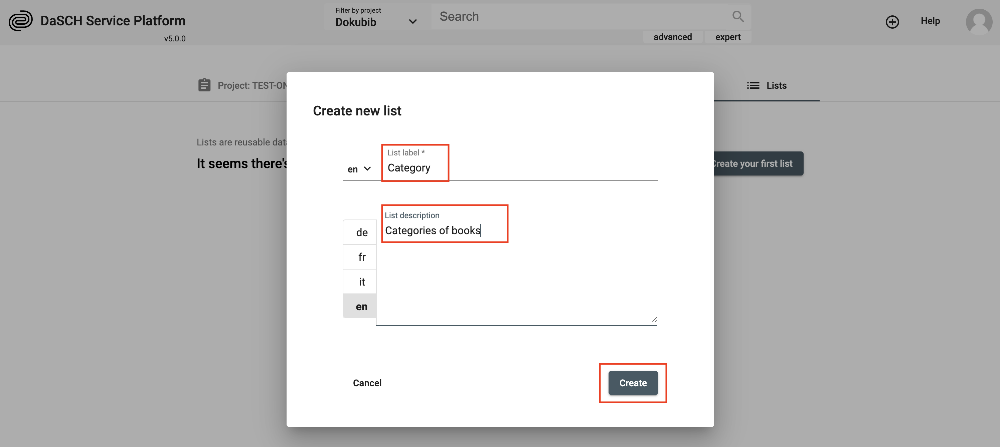

As soon as the list is created you can continue with the definition of your data model. The single list items you can define later. How to do this will be explained below. We first focus on the definition of a list property in the data model. Currently there is only one option for the display of a property of type *List*, namely *Dropdown*. It is capable to display flat as well as hierarchical lists.
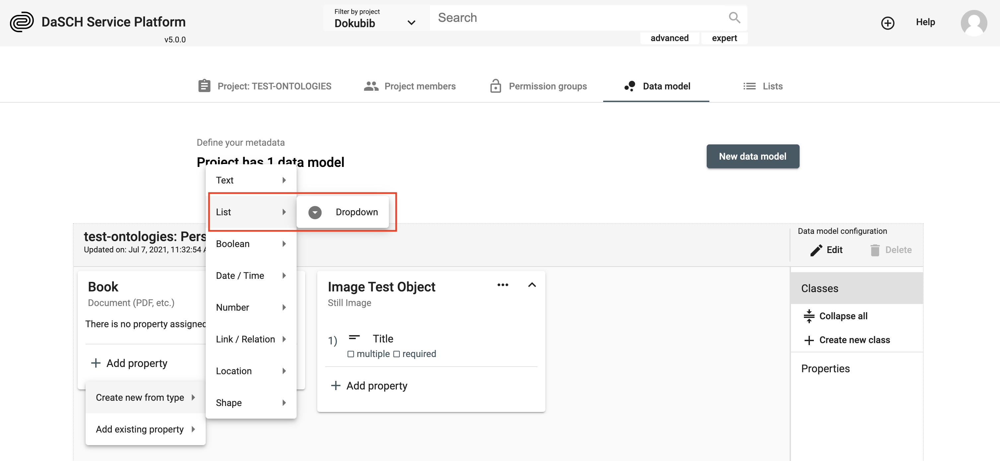

A new window opens up and as in the case of other properties you have to add a label, a desciption and to choose whether multiple values are allowed and/or whether this property is a required field. But in addition you have to select the list which contains your controlled vocabulary.
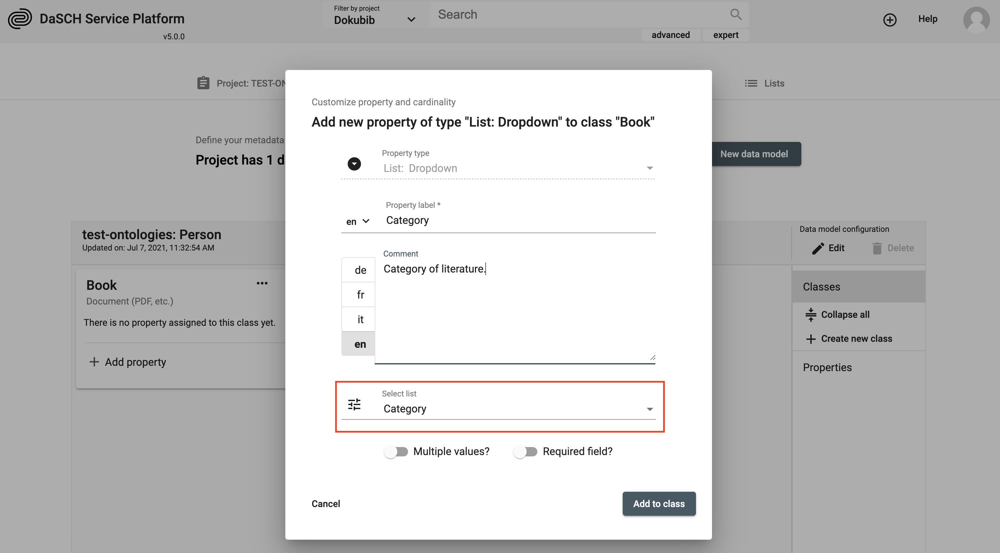

#### How to define items in a list
In our example we have created a list named *Category*. Now it is time to define the list items. We will as first hierarchy in our list some main literature genres. Enter the name of the list node and click the `+` as shown below:
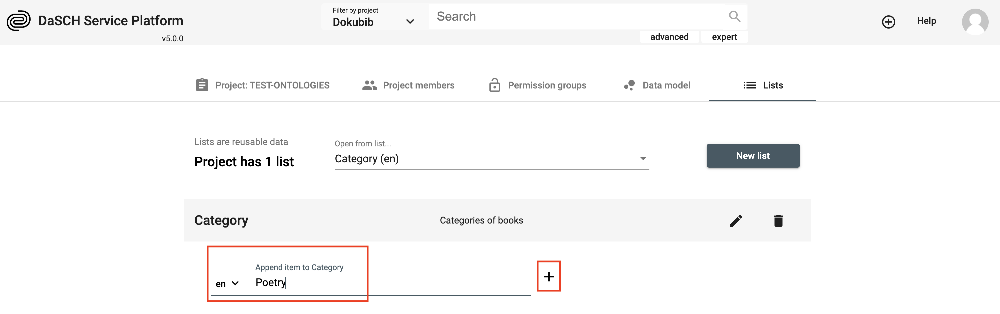

By clicking on the small arrow on the left a second hierarchical level becomes accessible where you can add items in the same was as for the main hierarchy. 
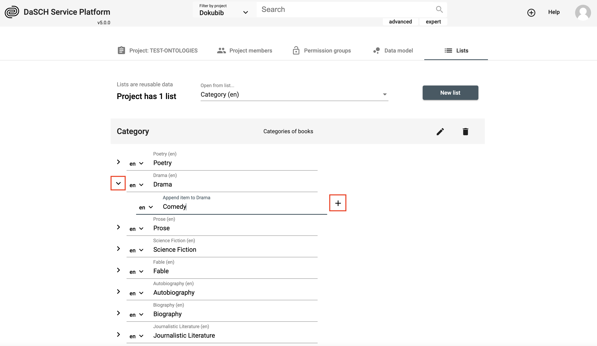

It is possible to add list items at any time. You may rearrange the order of your list items and add a new list item at a specific position in the list.
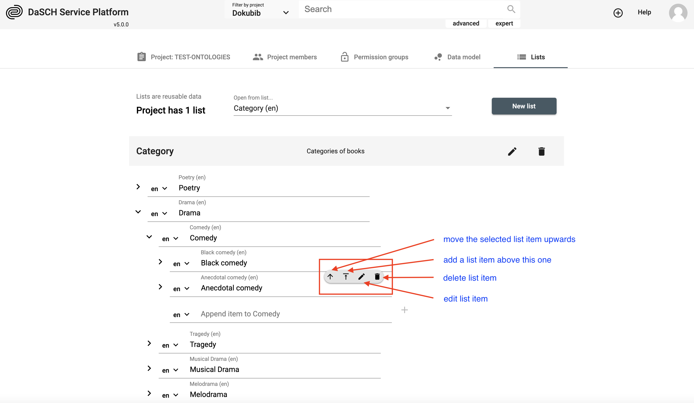

### Remove PROPERTIES from a resource class
To remove a property, hover over the property which you want to remove. By doing so you see a white x with a black background (removee button) appearing, it is yellow-rimmed in the image below:
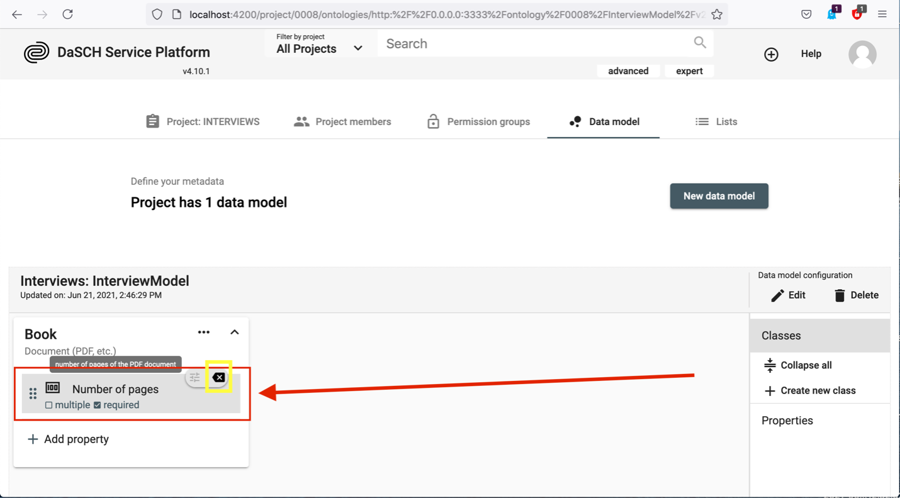

*Be aware, that you can only remove a property if there are no data yet!*
If you click the remove button, the property is removed and a green box pops up for a short time:
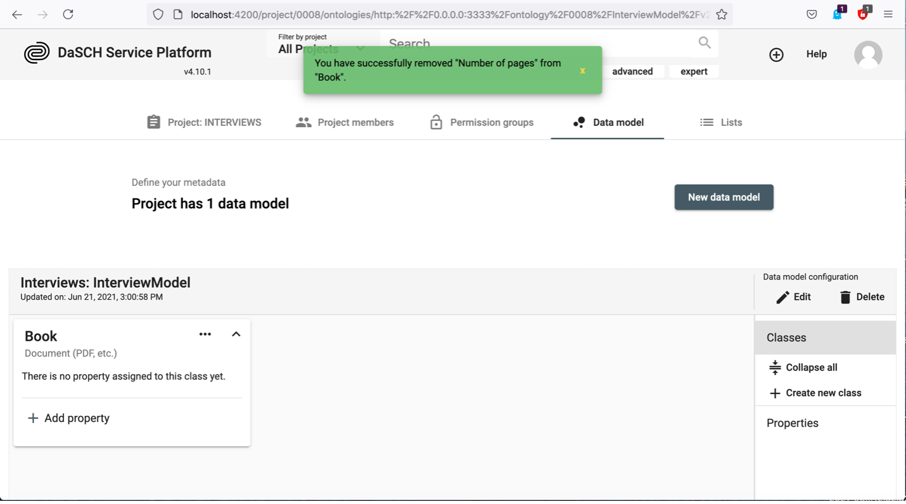

### Delete a property
In order to really delete a property you have to go to the `Properties` section as shown below. Click on `Properties`, and afterwards click on the waste basket sign of the property which you intend to delete.
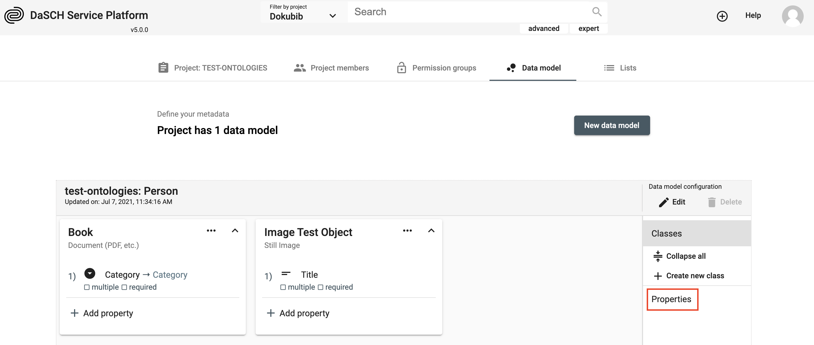
*Be aware, you can only delete properties which are NOT used in a resouce class!*

### Delete a CLASS
To delete a resource class, click on the three dots in the box of the class which you want to delete.
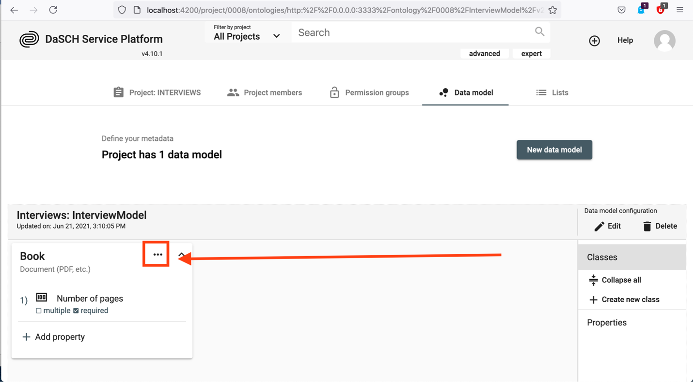

The following box appears and you then have to click `Delete resource class`.
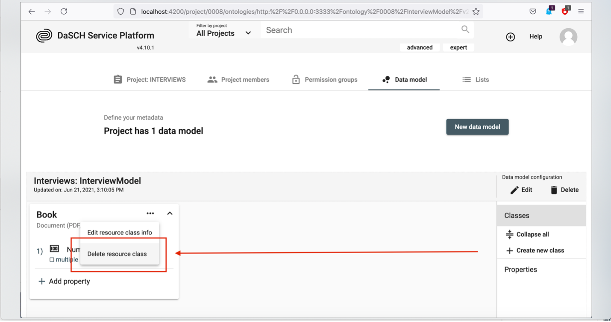

In the alert window popping up, you click the red button `Delete`. Afterwards, the resource class is deleted.

### Delete a data model
To delete a whole data model, you have to click the button `Delete` on the right-hand side in the section `Data model configuration`.
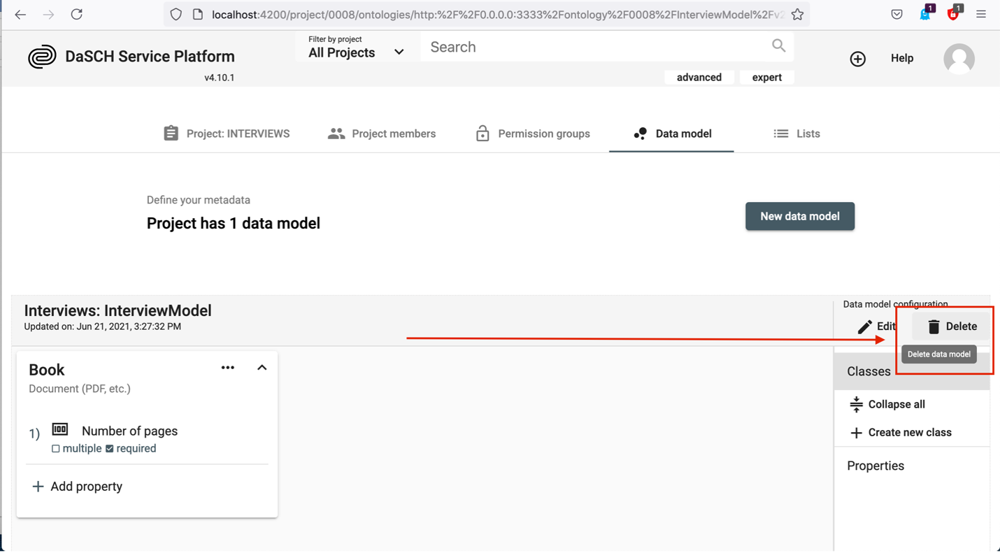

In the alert window appearing, you click the red button `Delete`. The data model is now deleted.

## An example
WIn the following example we focus on how we can reflect about our data before building our model and how a data model can relate classes to each other.

### Preparing a data model
You have interviewed 20 people and recorded the interviews. During these interviews you talked about photographs. Among all the data collected during the project, the most important are:
o	audio-files of the interview
o	transcribed text of conversations (or transcribe the files within the web application)
o	photographs
o	data about the person you interviewed
o	location where the photograph was taken

The following Diagram 1 shows the initial situation: 
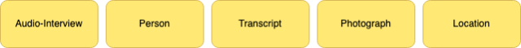*Diagram 1: the initial situation.*

The second step will be to consider the hierarchy of the data. How your hierarchy looks like depends on which criteria your data were organized and what your purposes are. It might even be possible that you don’t need a hierarchy as shown in Diagram 1.

In our case, we know that the transcripts are linked to the audio-interviews, persons are linked to interviews and audio-interviews, photographs are linked to audio-interviews and transcripts plus locations are linked to the photographs.

How the practical arrangement finally looks like depends on your purposes and preferences. For example we could choose to arrange the data with regards to their audio source as seen in Diagram 2:
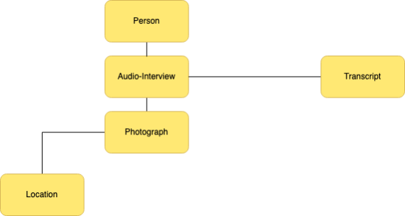*Diagram 2: Focus on the audio-interview.*

However, we can also prefer another visualization which focusses on the transcript (Diagram 3):
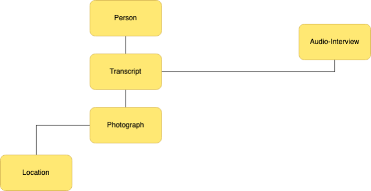*Diagram 3: Focus on the transcript.*

We could think of many different hierarchies, lastly it depends on what serves your purposes best. Our next step will be to implement the hierarchy in Diagram 3 in our data model.

### Creating the data model

**1. Create resource classes**
First, we create the resource classes that constitute the basic containers of our data model as depicted in Diagram 1:
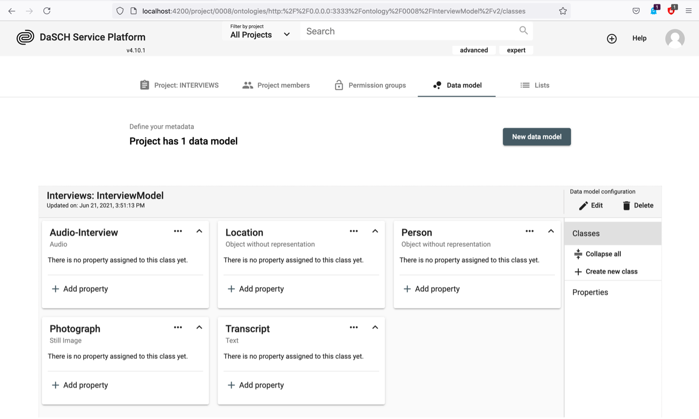

**2. Relate resource classes**
According to our Diagram 3, we determined the transcript to be the centre of the hierarchy. In the transcript, the photographs are mentioned, the interviewed person is linked to the transcript and the audio-interview as the raw source is linked to the transcript too. Thus, we have to add photograph, audio-interview and person as properties to the transcript. 

In the box of *Transcript* click on `+ Add property`:
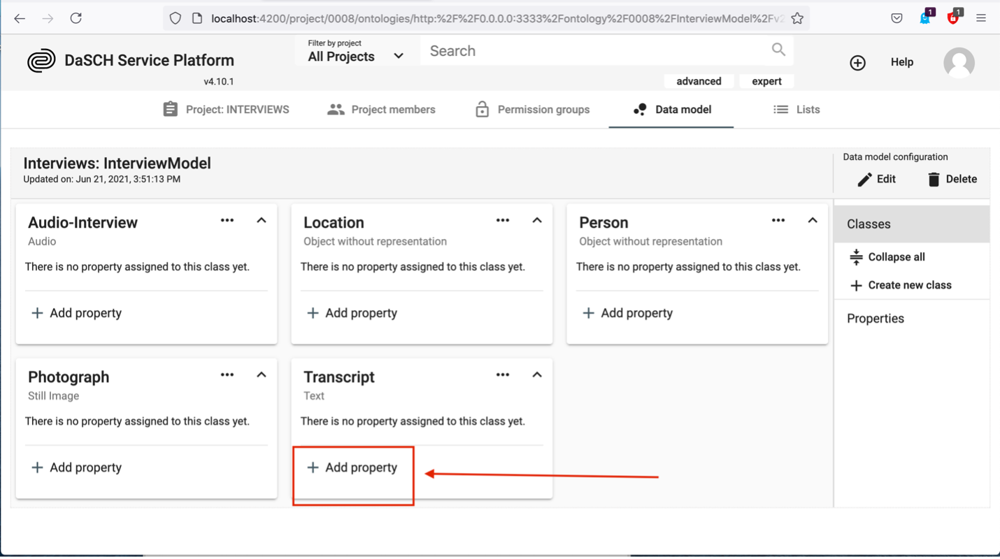

In the window that appears we hover over `Create new from type`, in the appearing box we hover over `Link` and in the next appearing box we click on `Resource class`.
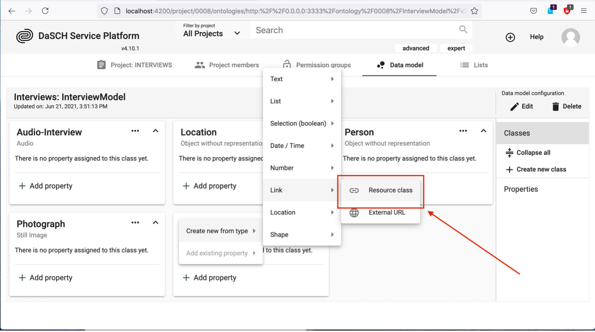

By clicking on `Resource class`, the following window pops up:
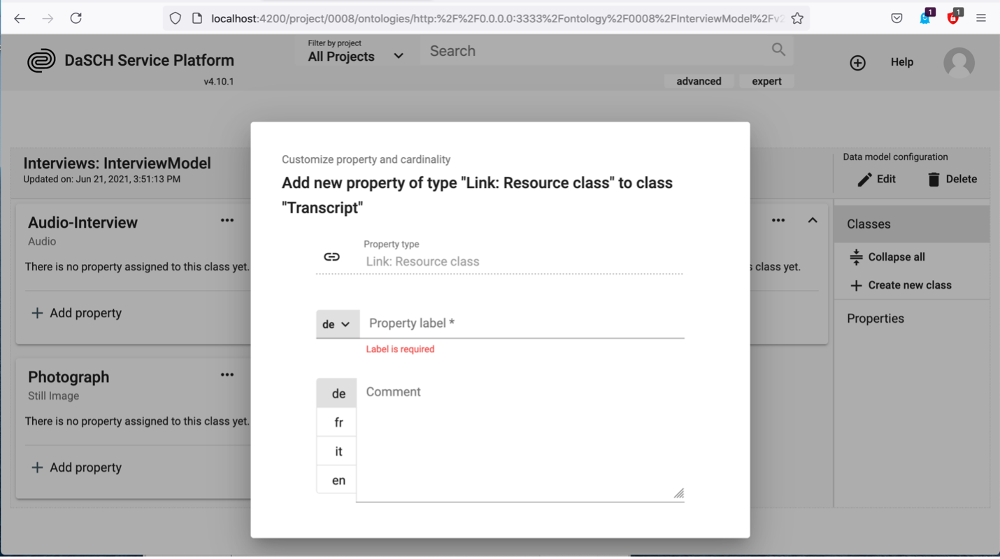

We can now fill in `Property label` *Audio*, and in `Select resource class` we choose from the list `Audio-Interview`. We should add a comment in at least one language to describe the property. It might also make sense to toggle `Required field?` since a transcript has to be extracted from the audio-interview:
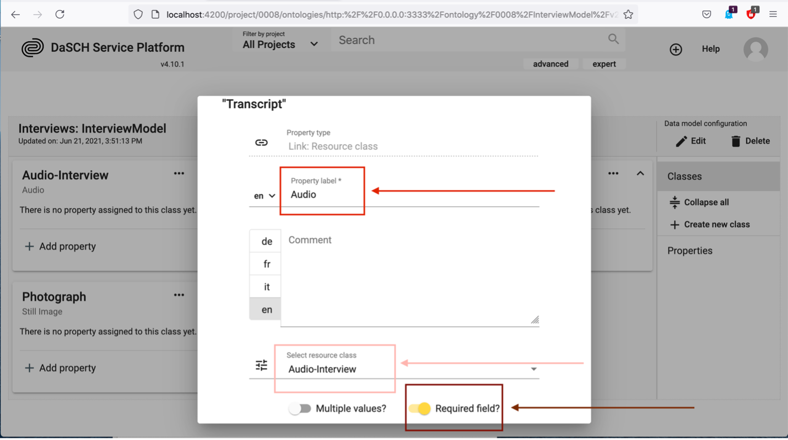

Finally, we click the `Add to class` button as seen below:
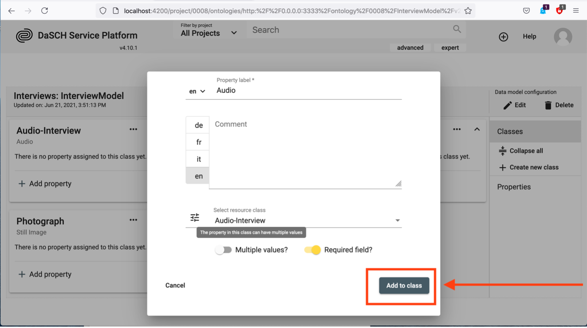

We should then see the new property, which is a class added to the *Transcript* properties:
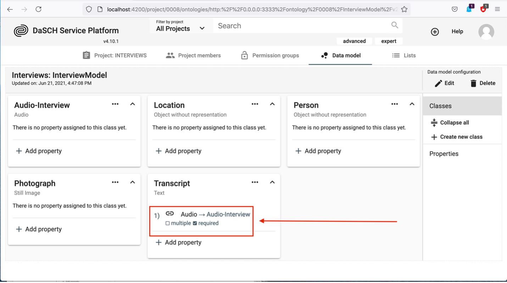

After the definition of the whole hierarchy as seen in Diagram 3, the data model looks like this:
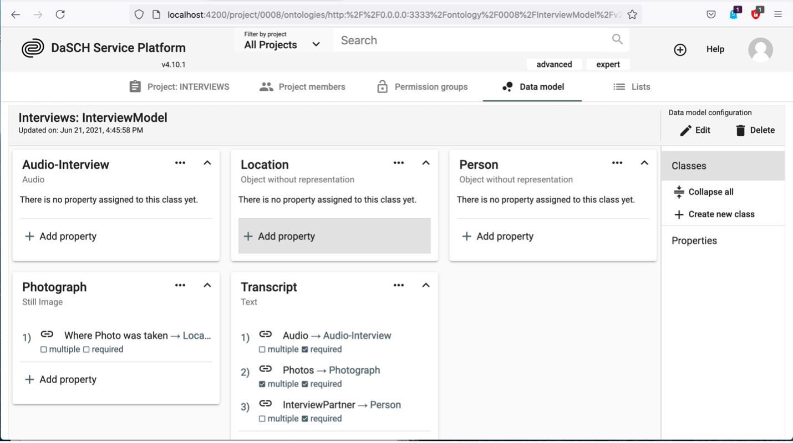

The resource class *Transcript* has the resource classes *Audio-Interview*, *Photograph* and *Person* as linked properties. Furthermore, the resource class *Photograph* has the class *Location* as linked property. In such a way we reflect the central position of *Transcript* in our data model.
