# Project Administration

## Project

Once you are [logged in](index.md#login), the projects overview page displays all the projects hosted at DaSCH.

Active projects are tagged with the status "Active". Projects tagged as "Deactivated" can no longer be edited. Only a system admin is allowed to change the project status.

The setting icon on the top right of each project tile is displayed only for projects and system admins. It leads to the project settings page.

*<https://app.dasch.swiss/> - DSP-APP projects overview page.*

By clicking on the button `Browse Data`, you go to the **project workspace**. You get access to the project information, the data model (if you are logged in), and the project settings (if you are logged in as a project admin or a system admin).

### Create a new project

Only a system admin can create a new research project, from the projects overview page or the page System Administration > All projects.

*Form to create a new project.*

This currently requires essential information such as the project name, a short name, and a shortcode (provided by DaSCH). A short project description is mandatory, it can be written in several languages as well as keywords.

### Define your project

From the side panel of the project workspace, as a project admin (or a system admin), you can access:

- **Project Description**: define your project information or edit it
- **Project Settings**: edit project description, edit image settings (only if you have the restricted view permission set on your images), add users as project members
- **Data Model**: define your data model and your controlled vocabularies
- **List of Resources**: view all resource classes, search by resource class, and create new resource instances

> Project members and logged-in users from other projects can also view the project description, the data model, and the list of resource classes.

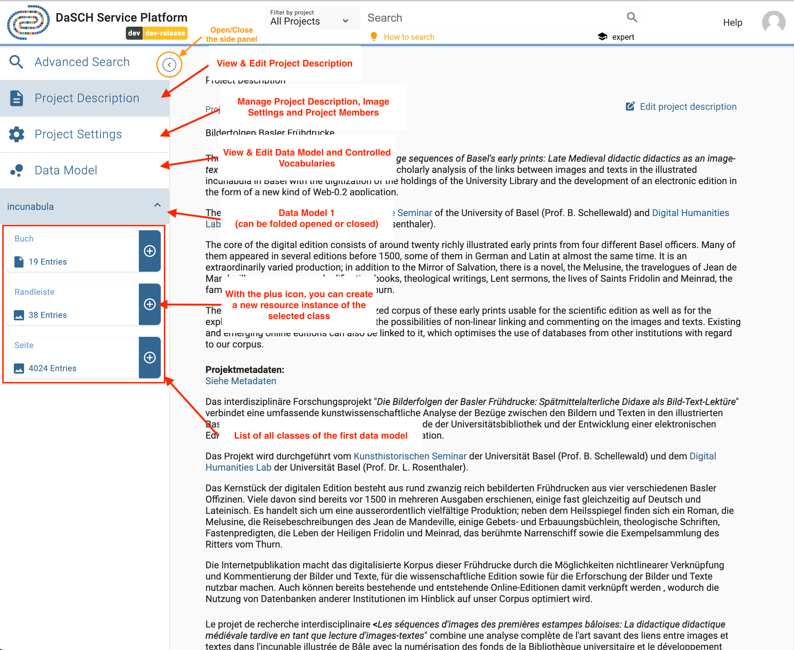*<https://app.dasch.swiss/project/3ABR_2i8QYGSIDvmP9mlEw> - Project management functionalities; e.g. Incunabula project. The side panel can be opened or closed by clicking on the chevron icon at the top.*

---

## Project Settings

On the Project Settings page, you can monitor and customize important aspects of your project. This includes updating the project description, changing image settings (only for resources that have the restricted view permissions set) and managing project members by adding, removing or changing their roles.

### Project Description

In this section, you can personalize key details of your project. You can change the project's name, update the description in multiple languages (de, fr, it, en, rm), and add or modify keywords. Just make the necessary changes and click "Save".
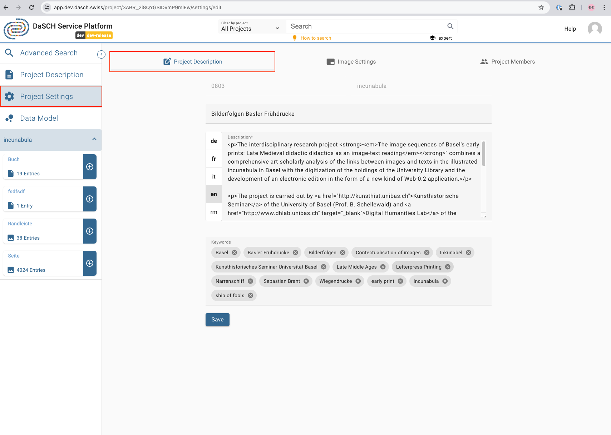*<https://app.dasch.swiss/project/3ABR_2i8QYGSIDvmP9mlEw/settings/edit> - Project Description page where project admin and system admin can change the project description of the project.*

### Image Settings

There are three statuses for image settings: Off, Apply Watermark, and Restrict Image Size. For projects without the permission set to restricted view on resources, the status is Off by default.
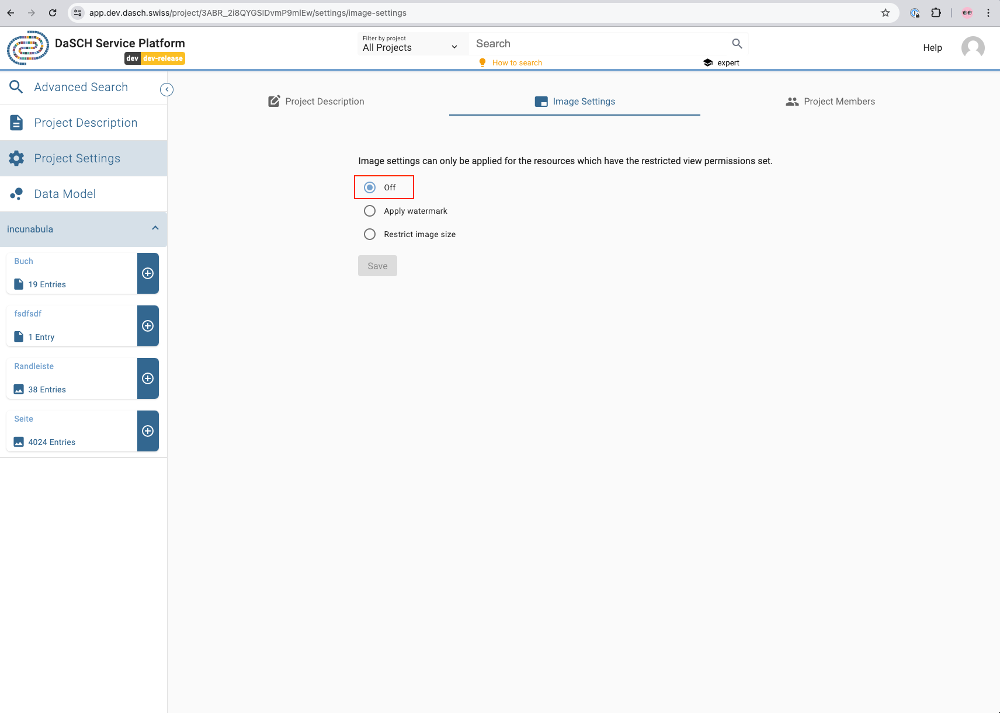*<https://app.dasch.swiss/project/3ABR_2i8QYGSIDvmP9mlEw/settings/image-settings> - By default, image settings are set to Off for projects without the permission set to restricted view on resources.*

#### Apply Watermark or Restrict Image Size

If the permission is set to restricted view on resources, you have two options:

- Apply Watermark: The watermark is a default one with the DaSCH logo.
- Restrict Image Size: You can limit the image size by percentage or absolute value.

Simply make your changes and click "Save."

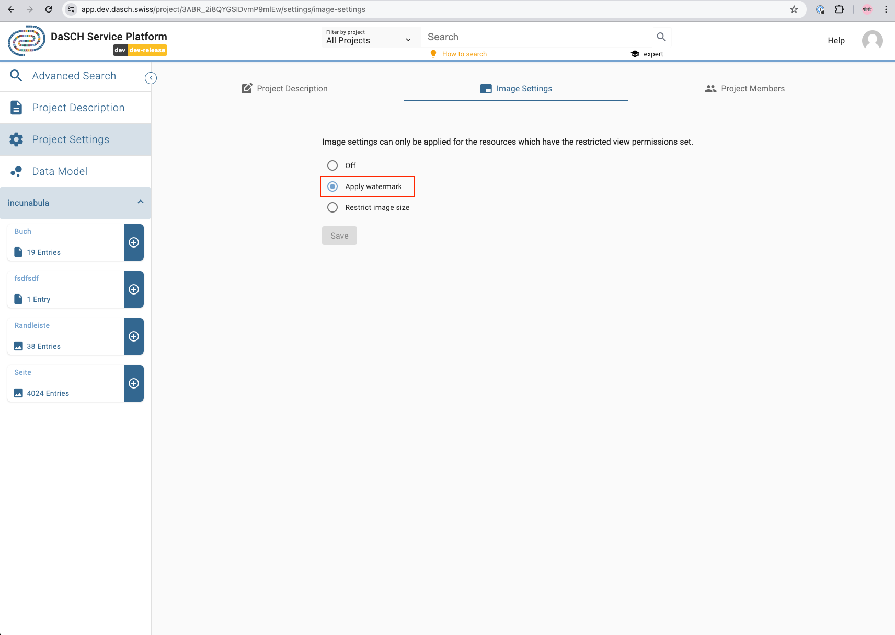*<https://app.dasch.swiss/project/3ABR_2i8QYGSIDvmP9mlEw/settings/image-settings> - When you choose the watermark option, a default watermark with the DaSCH logo will be applied to the images.*

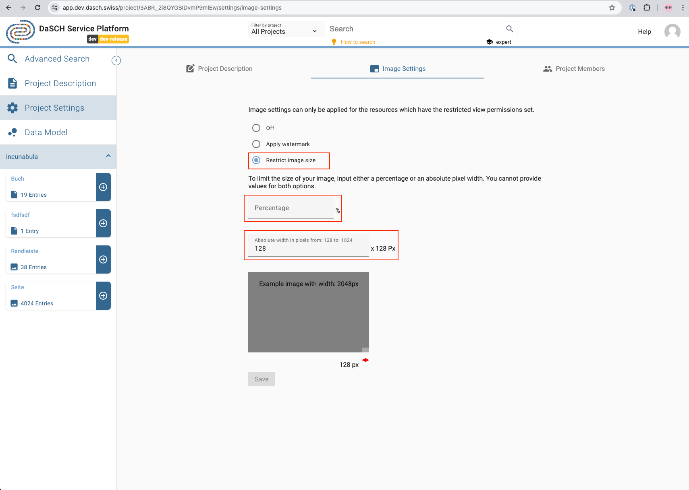*<https://app.dasch.swiss/project/3ABR_2i8QYGSIDvmP9mlEw/settings/image-settings> - When you choose the Restrict Image Size option, you can limit the image dimensions by either percentage or absolute value.*

### Project Members

As a project admin (or a system admin), you can add users as project members. The admin can grant another user as project admin (or remove this permission), edit the user's information, change the user's password if forgotten, and remove a user from the project by clicking on the three-dot icon to the right side of the user line.

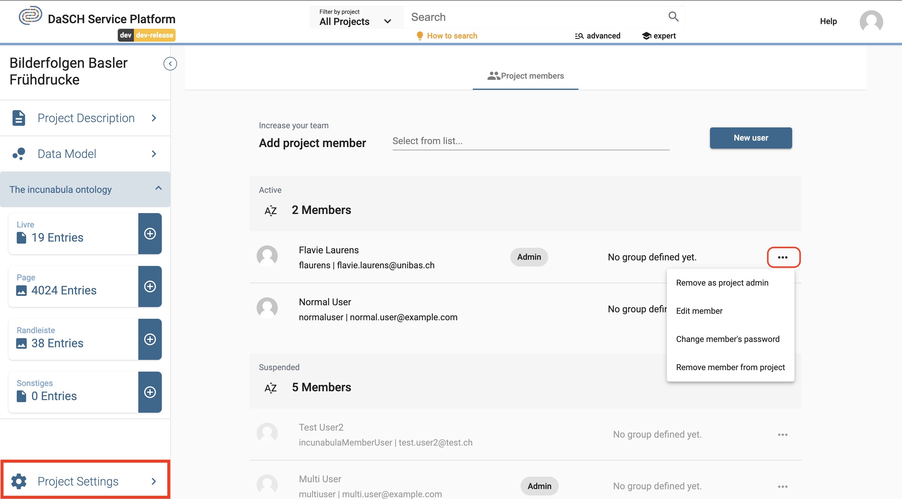*<https://app.dasch.swiss/project/3ABR_2i8QYGSIDvmP9mlEw/settings/collaboration> - Project Members page where project admin and system admin can add new users to the team.*

From the project workspace, as a project member, you can:

- View the project information
- View the data model
- Get the list of resource classes with the number of entries, and click on the tiles to make a search by resource class
- Create or edit resources

---

## Data Model

The definition of the data model (*ontology*) is the most important step. The data model is indispensable for structuring your data. Our platform provides a tool for the easy creation of one or more project data models. First, you have to know which data and resources you want to work with. The data model can be flexible and customizable.

The question which you have to answer before you create your data model is **according to which criteria do you organize your data**? In this respect it may be useful to ask yourself:

- *How are your data organized?*
- *What are the goals you want to achieve, which research questions do you want to answer?*

As soon as you have come to a conclusion concerning the structure of your data, you're all set to create your data model.

### Data Model Overview

To see the list of existing data models and to create a new one, you go to your project workspace and click on the `Data Model` button in the side panel.

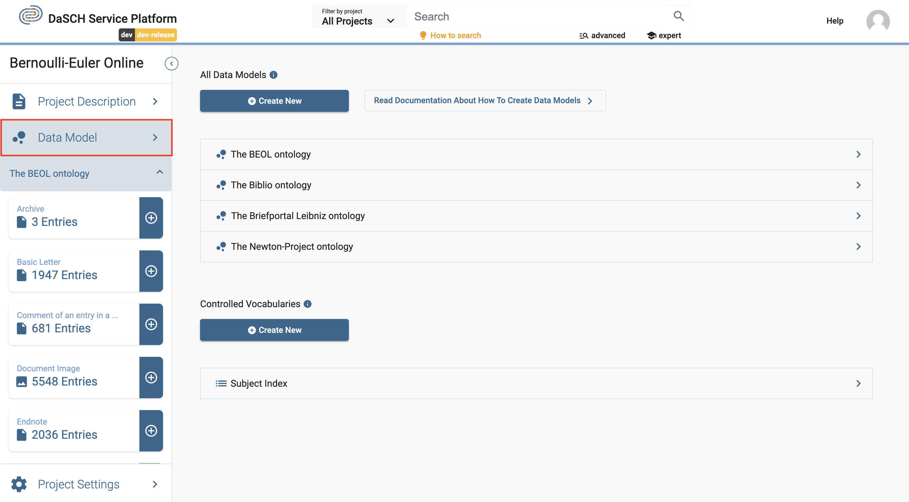

If you click on a data model name from the list, you get access to the detailed view of the data model (= ontology editor). It can be edited only by project admins. However, **any other logged-in users can see the data model in read mode only**. Logged-out users don't have access yet.

### Create your data model

From the data model overview page, click on the button `Create New`. You can fill in the creation form with precise information.

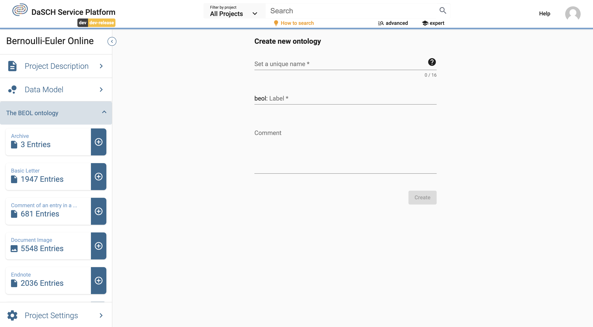

Now you have to set a unique name (*please consider the NOTE*) and you can add a comment. Push the button `Create` to create your data model.

> **NOTE: There are some rules for the unique name:**
>
> - must be at least 3 characters long
> - shouldn't start with a number
> - shouldn't start with the letter v and a number
> - spaces or special characters are not allowed
> - may not contain these reserved terms:
>     - knora
>     - ontology
>     - salsah
>     - shared
>     - simple
>     - standoff
> - the unique name can't be changed afterward!

*The label is a combination of the project's short name and the unique name. You can replace it with any other string.*

After the creation of your data model, your page should look like this:

---

### Create resource CLASSES

You can then create a resource class by clicking the button `+ Create new class`:

By clicking `+ Create new class`, a small window pops up with six basic types to choose from:

Which type you choose depends on the data type which you need to describe. Let's assume you have pdf-documents of books and they have a number of pages. To describe this in an ontology, you create a class as `Document` by clicking on `Document`. A dialog box pops up which looks like this:

For the label you could write *Book*, and you should add a preferably meaningful comment in at least one of the predefined languages English (en), German (de), French (fr) or Italian (it). Then click the `Submit` button:

Now you have created your first class *Book*, as seen below:

---

### Add PROPERTIES to a resource class

Now you can add properties to your class. Your pdf of a book has a number of pages. Hence, it may be useful to define the number of pages as one of the properties of your class *Book*. Click on `+ Add Property` in the *Book* box:

Theoretically, you have two options now. If you defined properties before, you may simply add them here (second option in the following image). If you just start adding properties, you have to choose `Create new from type`.

By hovering over `Create new from type`, a new menu box appears:

You can choose from a selection of the following basic types with various subtypes:

- Text (*Short*, *Paragraph*, *Rich Text*)
- List (*Dropdown*)
- Boolean (*Yes/No* selection; checkbox)
- Date / Time (*Date*, *Timestamp*, *Time sequence*)
- Number (*Integer*, *Decimal*, *Page number*)
- Link / Relation (*Link to Class*, *Part of Class*, *External URL*)
- Location (*Place*; a [geonames-identifier](https://www.geonames.org/))
- Shape (*color*)

Since in our example you want to add a property for the number of pages of your book, you choose `Number`. Now you will see that you can either choose the type `Decimal`, `Integer` or `Page number` for your property.

Page numbers have no decimal places, thus you will select `Integer` (or `Page number` which is a special case (s. [next section](#correct-property-selection-in-case-of-special-classes))) as the type for your property. The following window pops up:

In the field *Property label* add for example *Number of pages*, in the comment section you should add a meaningful explanation. It might also make sense to toggle `Required field?` since every PDF Document consists of a number of pages. If you toggle it, the number of pages MUST be given if you add data to the class *Book* - it would then be a required field, not an optional one and data could only be saved if you add the number of pages.

If you want to define a property which can have more than one value, you should tick `Multiple values?`. For the number of pages of a book this does not make sense, but in the case you want to define a property describing which people are mentioned in your *Book*, the option multiple values is likely to be needed.

Now you should see the new property in the box as seen below:

## Changing cardinalities of properties

Changing cardinalities in a data model involves modifying the relationships between resource classes, which can affect the number of instances of a resource class that can be associated with another resource class. *In general, before changing the cardinalities, it is important to understand the affected resource classes and the relationships between them. Determine which resource classes will be affected by the change and how the relationships between them will be changed. This is especially important if data already exists!*

### Widening or restricting a cardinality of a property without data

If there is no data yet available, widening or restricting the cardinality can be relatively straightforward.
Widening the cardinality of a data model refers to changing the relationship between resource classes in a way that allows more instances of a resource class to be associated with another resource class. Restricting the cardinality of a data model refers to limiting the number of instances of a resource class that can be associated with another resource class. Here are the steps to changing the cardinality of a data model when there is no data yet available:

In this example activate the toggle "multiple" for widening the cardinality:
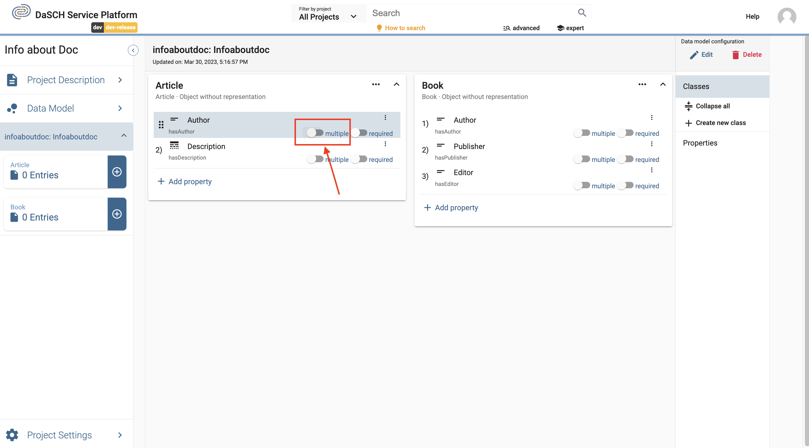

The pop-up window informs you that you are going to change the cardinality and you may not be able to reverse it:
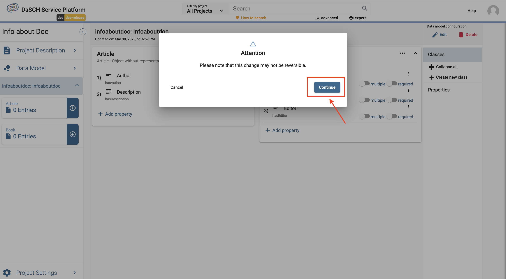

If you want to confirm the change, click "Continue" and the toggle will now be activated. The same procedure applies to the toggle "required":
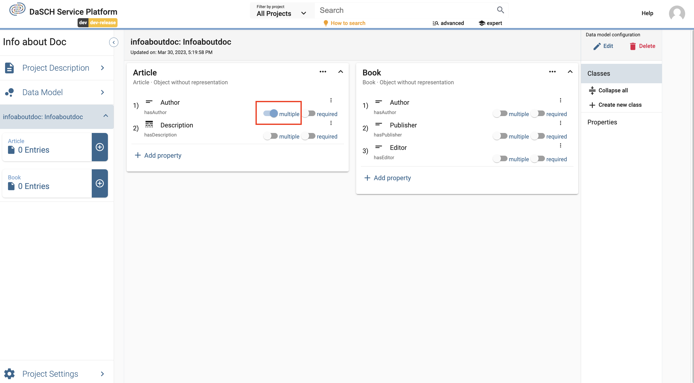

### Widening or restricting a cardinality of a property with data

If data is already present, widening and restricting the cardinality of a property is possible if e.g., in a required property in every resource the values are available. In this case the same procedure applies as described in the sections above.

### Widening or restricting a cardinality of a property if a resource does not contain all the values

If values are missing in the resources and you want to adjust the cardinality so that the resources do not match the selected cardinality (e.g. set a property to required, but the field is empty), an error message is displayed. In this case, all resources must be corrected first, then the desired cardinality can be set.

### Widening or restricting a cardinality of a property: Special cases

#### Superclasses and subclasses

Changing the cardinality of a superclass and a subclass and reversing it does not work if the properties are in a subproperty relationship or the changed property in the superclass does not exist in the subclass.

### Correct property selection in case of special classes

#### Book class with pages as individual classes

If you have single digitized pages of a book in your project, they can be defined as its own individual *Still image* class type. In this case the — let's call it *Page* — class needs two specific properties to work the correct way. One is the `part of`-property which can be found in the list of properties in the section "Link / Relation". This property points to the main class called *Book* (which should be defined first and is type of *Object without representation*). The second property is for the `page number` definition and is also necessary. This default property can be found in the list of properties in the section called "Number".

This is how a book and the page class could look like:
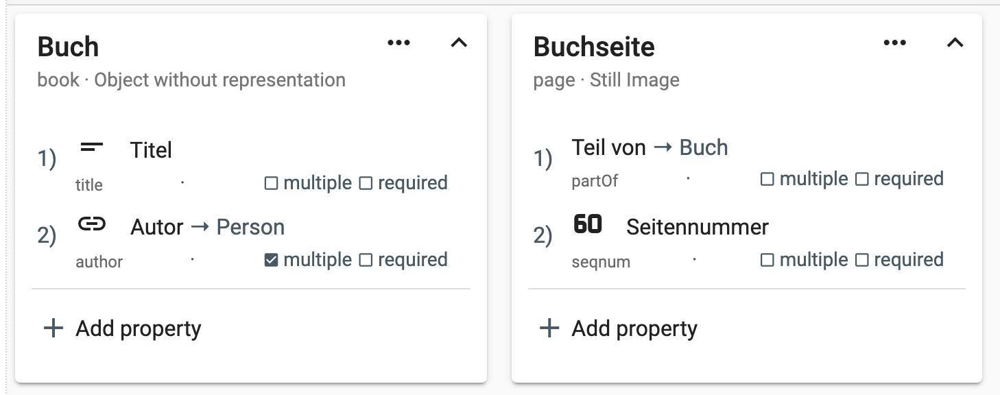

### Define Controlled Vocabularies

One of the possible property types to choose from is *List* (= Controlled Vocabulary). Controlled vocabularies are hierarchical or non-hierarchical lexica of reference terms. Due to their normative or standardized nature, controlled vocabularies improve data quality and make database searching more efficient than free-text fields. Typical examples are keywords. In your book example, it may be useful to define a property that describes to which category of literature your pdf of a book belongs. **Before** you can add a property of type *List* to your data model, you have to define this controlled vocabulary. For its definition, you go to the data model overview page from your project workspace (Step 1):
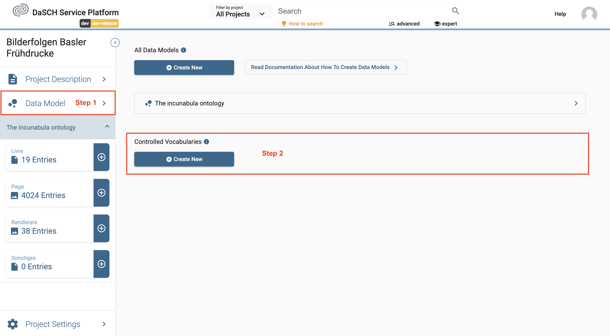

Click `Create New` (Step 2). A creation form appears where you enter a label and a short description, then click `Create`.
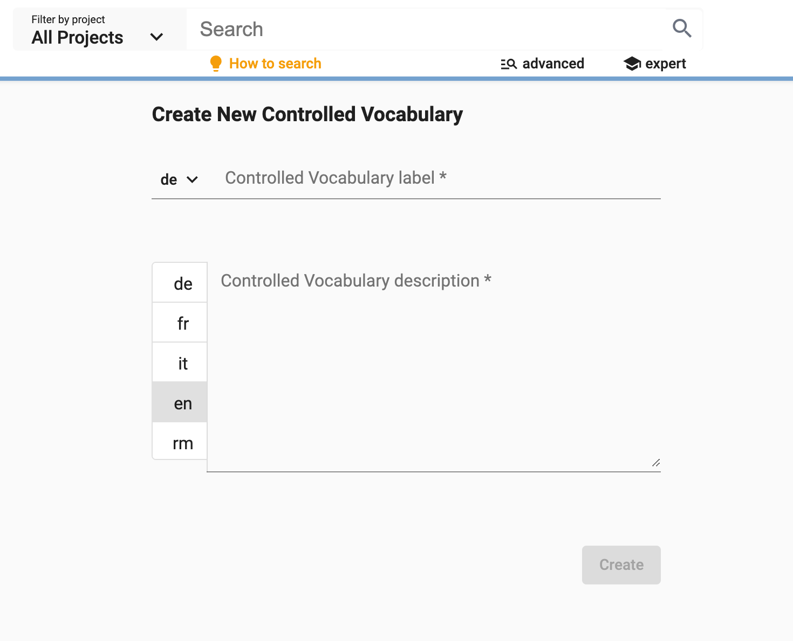

As soon as the controlled vocabulary is created, you can continue with the definition of your data model. You can define the individually controlled vocabulary items later. How to do this will be explained below. We first focus on the definition of a property of type `List` in the data model. Currently, there is only one option for displaying a property of this type, namely *Dropdown*. It is capable of displaying flat as well as hierarchical lists.

A new window opens up and as in the case of other properties you have to add a label, and a description and choose whether multiple values are allowed and/or whether this property is a required field. But in addition, you have to select the list which contains your controlled vocabulary.

#### How to define items in a controlled vocabulary

In our example, we have created a controlled vocabulary named *Category*. Now, it is time to define the items. We will list some main literary genres as the first hierarchy in our controlled vocabulary. Enter the name of the node and click the `+` as shown below:

By clicking on the small arrow on the left a second hierarchical level becomes accessible where you can add items in the same way as for the main hierarchy.

It is possible to add controlled vocabulary items at any time. You may rearrange the order of your items and add a new item at a specific position in the list.

### Remove PROPERTIES from a resource class

To remove a property, hover over the property which you want to remove. By doing so you see a white x with a black background (remove button) appearing, it is highlighted in yellow in the image below:

*Be aware, that you can only remove a property if there are no data yet!*
If you click the remove button, the property is removed and a green box pops up for a short time:

### Delete a property

In order to really delete a property you have to go to the `Properties` section as shown below. Click on `Properties`, and afterwards click on the waste basket sign of the property which you intend to delete.

*Be aware, you can only delete properties which are NOT used in a resource class and if they were never used! This means an already used properties even with deleted values cannot be deleted!*

### Delete a CLASS

To delete a resource class, click on the three dots in the box of the class which you want to delete.

The following box appears and you then have to click `Delete resource class`.

In the alert window popping up, you click the red button `Delete`. Afterwards, the resource class is deleted.

### Delete a data model

To delete a whole data model, you have to click the button `Delete` on the right-hand side in the section `Data model configuration`.

In the alert window appearing, you click the red button `Delete`. The data model is now deleted.

## An example

In the following example we focus on how we can reflect about our data before building our model and how a data model can relate classes to each other.

### Preparing a data model

You have interviewed 20 people and recorded the interviews. During these interviews you talked about photographs. Among all the data collected during the project, the most important are:

-	audio-files of the interview
-	transcribed text of conversations (or transcribe the files within the web application)
-	photographs
-	data about the person you interviewed
-	location where the photograph was taken

The following Diagram 1 shows the initial situation:

*Diagram 1: the initial situation.*

The second step will be to consider the hierarchy of the data. How your hierarchy looks like depends on which criteria your data were organized and what your purposes are. It might even be possible that you don’t need a hierarchy as shown in Diagram 1.

In our case, we know that the transcripts are linked to the audio-interviews, persons are linked to interviews and audio-interviews, photographs are linked to audio-interviews and transcripts plus locations are linked to the photographs.

How the practical arrangement finally looks like depends on your purposes and preferences. For example we could choose to arrange the data with regards to their audio source as seen in Diagram 2:

*Diagram 2: Focus on the audio-interview.*

However, we can also prefer another visualization which focuses on the transcript (Diagram 3):

*Diagram 3: Focus on the transcript.*

We could think of many different hierarchies, lastly it depends on what serves your purposes best. Our next step will be to implement the hierarchy in Diagram 3 in our data model.

### Creating the data model

**1. Create resource classes**
First, we create the resource classes that constitute the basic containers of our data model as depicted in Diagram 1:

**2. Relate resource classes**
According to our Diagram 3, we determined the transcript to be the center of the hierarchy. In the transcript, the photographs are mentioned, the interviewed person is linked to the transcript and the audio-interview as the raw resource is linked to the transcript too. Thus, we have to add photograph, audio-interview and person as properties to the transcript.

In the box of *Transcript* click on `+ Add property`:

In the window that appears we hover over `Create new from type`, in the appearing box we hover over `Link` and in the next appearing box we click on `Resource class`.

By clicking on `Resource class`, the following window pops up:

We can now fill in `Property label` *Audio*, and in `Select resource class` we choose from the list `Audio-Interview`. We should add a comment in at least one language to describe the property. It might also make sense to toggle `Required field?` since a transcript has to be extracted from the audio-interview:

Finally, we click the `Add to class` button as seen below:

We should then see the new property, which is a class added to the *Transcript* properties:

After the definition of the whole hierarchy as seen in Diagram 3, the data model looks like this:

The resource class *Transcript* has the resource classes *Audio-Interview*, *Photograph* and *Person* as linked properties. Furthermore, the resource class *Photograph* has the class *Location* as linked property. In such a way we reflect the central position of *Transcript* in our data model.
