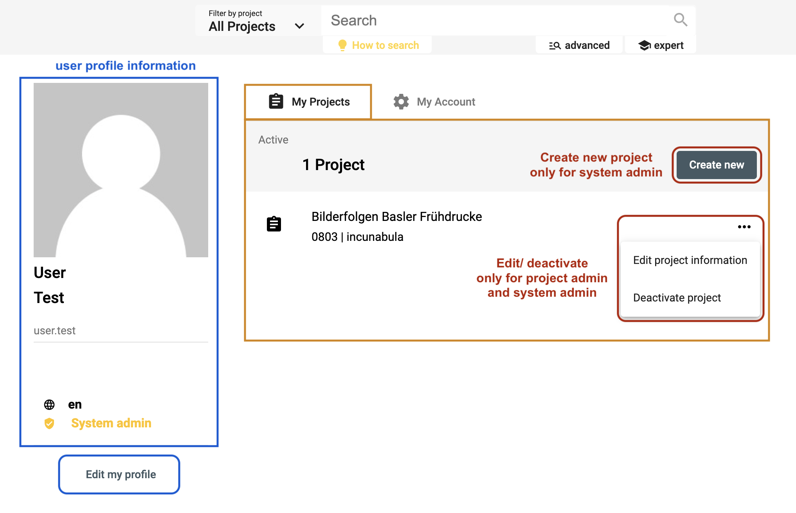
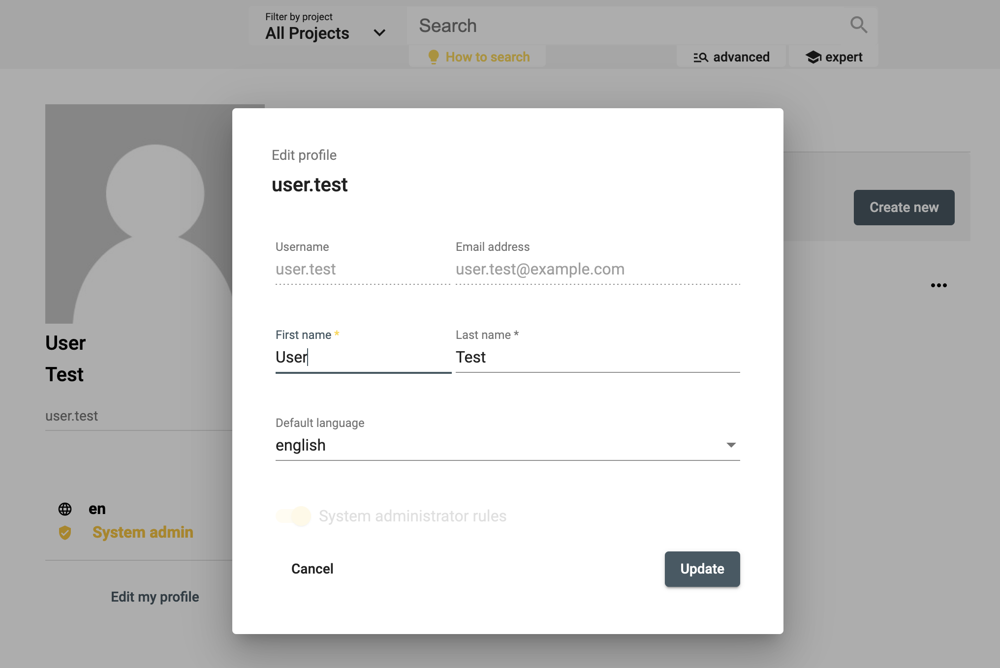
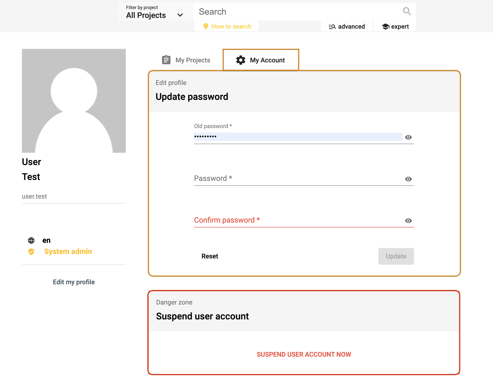

# User Profile

## Your user profile and projects

To change your personal information as well as your default language used by the interface, you can edit your profile by clicking *Edit my profile*. Currently, the avatar image comes from gravatar.com (go on their [website](http://en.gravatar.com/) to register if you want your customized user photo).

*<https://app.dasch.swiss/> - Overview of your user profile and your projects.*

The list of your projects is accessible from here, click on one project to get more information about it. As a project admin, you can also edit or archive your projects, and as a system admin, you can additionally create new projects.

*Edit your user profile. The username, the email address, and the admin rules are not editable.*

---

## Your account

As a matter of security, it is strongly recommended to update your password at least once a year. On your account page, you can update your password.

*<https://app.dasch.swiss/account> - Update your password and deactivate your user account.*

&#9888;
You can delete (deactivate) your own user account. However, only a system administrator will be able to reactivate it.
